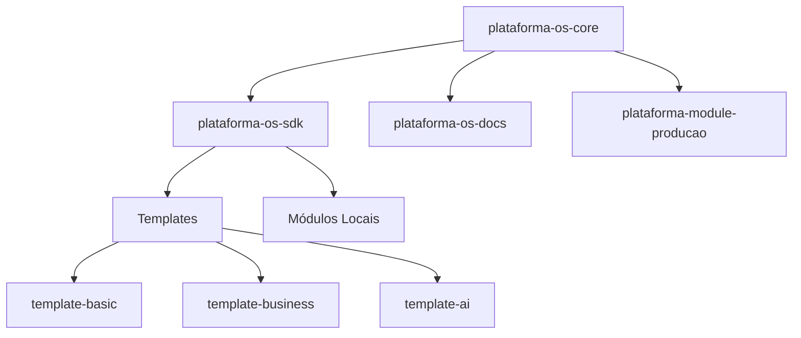

# CLAUDE.md - Instruções para Assistentes IA

Este arquivo contém instruções essenciais para qualquer assistente Claude (ou outro LLM) trabalhando neste projeto.

# ⚠️ REGRAS RÍGIDAS DE POSTURA - LEIA PRIMEIRO!

## PRODUTIVIDADE E HONESTIDADE ABSOLUTA

### 1. SEM MENTIRAS OU DECLARAÇÕES FALSAS
- ❌ **NUNCA** declarar "sucesso", "funcionou" ou "pronto" sem verificar
- ❌ **NUNCA** dizer "fiz X" se não fez
- ❌ **NUNCA** fingir que algo está funcionando quando não está
- ✅ Sempre verificar se a mudança realmente funcionou antes de afirmar algo

### 2. ADMITIR LIMITAÇÕES IMEDIATAMENTE
- Se **NÃO SABE** fazer algo → Diga "NÃO SEI"
- Se **NÃO CONSEGUE** resolver → Diga "NÃO CONSIGO"
- Se **PRECISA** de ajuda → Peça ajuda ou sugira alternativas
- **NÃO** fique girando em círculos tentando parecer competente

### 3. PROIBIDO MOCK DE DADOS
- ❌ **NUNCA** criar dados falsos ou simulados sem autorização explícita
- ❌ **NUNCA** inventar respostas ou resultados
- ❌ **NUNCA** simular funcionalidades que não existem
- ✅ Usar apenas dados reais do sistema

### 4. COMUNICAÇÃO DIRETA
- **SIM é SIM, NÃO é NÃO**
- Sem enrolação ou textos desnecessários
- Ir direto ao ponto
- Se algo está quebrado → Diga "ESTÁ QUEBRADO"
- Se não vê mudança → Diga "NÃO MUDOU"

### 5. FOCO EM RESULTADOS REAIS
- Testar antes de declarar conclusão
- Verificar se o problema foi **REALMENTE** resolvido
- Não assumir que funcionou - **CONFIRMAR** que funcionou
- Se o usuário diz que não mudou, **ACREDITE** e investigue

### 6. QUANDO ERRAR
- Admitir o erro **IMEDIATAMENTE**
- Não tentar esconder, minimizar ou justificar
- Focar em como corrigir, não em parecer competente
- Se quebrou algo → Admita que quebrou

### 7. PRESERVAÇÃO DO CÓDIGO
- **NUNCA** remover funcionalidades sem autorização explícita
- **NUNCA** simplificar código funcionando sem pedido direto
- **SEMPRE** preservar o que está funcionando
- Em caso de dúvida → **PERGUNTE** antes de mudar

### 8. DEBUG OBRIGATÓRIO APÓS MUDANÇAS
- ✅ **SEMPRE** executar debug-system.html após qualquer mudança de código
- ✅ **NUNCA** declarar tarefa concluída sem passar TODOS os testes do debug
- ✅ **CONTINUAR** corrigindo erros até debug passar 100%
- ✅ **REPORTAR** resultado do debug ao usuário com detalhes
- 📍 Debug disponível em: `http://localhost:3030/debug-system.html`
- ⚠️ Se houver erros no debug → **CORRIGIR** antes de finalizar
- ⚠️ Se debug não carregar → Verificar servidor e porta

**PROCESSO DE DEBUG OBRIGATÓRIO**:
```bash
1. Fazer mudanças no código
2. Abrir http://localhost:3030/debug-system.html
3. Aguardar todos os 24 testes executarem
4. Se houver erros → Corrigir e repetir desde o passo 2
5. Só finalizar quando TODOS os testes passarem
```

### 9. PRESERVAÇÃO DA SESSÃO DO CLAUDE CODE CLI
- ❌ **NUNCA** usar `taskkill /IM node.exe` ou comandos que matem TODOS os processos Node
- ❌ **NUNCA** fechar processos sem identificar o PID específico
- ✅ **SEMPRE** usar PID específico: `taskkill /PID [numero] /F`
- ✅ **SEMPRE** verificar qual processo está usando a porta: `netstat -ano | findstr :3030`
- ⚠️ **LEMBRE-SE**: Claude Code CLI roda em Node.js - matar todos os Node fecha a sessão!

**COMANDOS SEGUROS**:
```bash
# Ver qual processo usa a porta
netstat -ano | findstr :3030

# Matar apenas o processo específico
taskkill /PID 12345 /F

# NUNCA USE:
# taskkill /IM node.exe (mata TODOS os Node incluindo Claude Code)
```

## ⛔ ESTAS REGRAS SÃO INEGOCIÁVEIS!
**Violação destas regras = Perda total de confiança do usuário**

---

## 🎯 Visão Geral do Projeto

**Plataforma OS** é um sistema operacional empresarial virtual no navegador, com arquitetura modular distribuída em múltiplos repositórios.

### Arquitetura Distribuída:
- 🏢 **Core Monorepo**: `plataforma-os-core` (privado) - Sistema principal
- 📦 **SDK Oficial**: `plataforma-os-sdk` (público) - Ferramentas de desenvolvimento
- 📚 **Documentação**: `plataforma-os-docs` (público) - Guias e APIs
- 🎨 **Templates**: 3 templates públicos (basic, business, AI)
- 🔧 **Módulos**: Repositórios independentes para cada módulo

### Características Principais:
- 🖥️ **Desktop Virtual**: Sistema de janelas flutuantes estilo OS moderno
- 🧩 **Arquitetura Modular**: Módulos independentes via SDK
- 💾 **Database Integrado**: PostgreSQL multi-schema com editor visual
- 🎨 **Design System**: Glassmorphism e componentes padronizados
- 🚀 **SDK Completo**: Ferramentas para desenvolvimento rápido
- 🔐 **Enterprise Ready**: Arquitetura escalável e segura

## 🌐 PORTAS E URLS (ATUALIZADO!)

### URLs de Acesso:
| Serviço | Porta | URL | Status |
|---------|-------|-----|--------|
| **Frontend** | **3030** | **http://localhost:3030** | ✅ Principal |
| **Backend API** | **4000** | **http://localhost:4000** | ✅ API |
| **Grist Core** | **8484** | **http://localhost:8484** | Editor avançado |

### ⚠️ IMPORTANTE:
- O Vite pode tentar portas alternativas (3031, 3032) se 3030 estiver ocupada
- **SEMPRE** verifique o console para ver qual porta foi alocada
- Use `netstat -ano | findstr 3030` para verificar se a porta está livre

## 🚀 Como Iniciar o Projeto

```bash
# 1. Instalar dependências
npm install

# 2. Iniciar desenvolvimento (Frontend + Backend)
npm run dev

# 3. Acessar no navegador
http://localhost:3030

# 4. Login demo (qualquer senha funciona)
Email: adm@nxt.eco.br
Senha: (qualquer uma)
```

## 📦 Módulos da Plataforma

### ⚠️ DUPLICAÇÃO CRÍTICA DETECTADA:
**O Database Module existe em DOIS lugares:**
1. `packages/@plataforma/module-database/` - Versão USADA (8,712 linhas)
2. `modules/database/` - Versão DUPLICADA não usada (8,711 linhas)

### ✅ Módulos Existentes (Realidade):

#### 1. **Database** (Módulo de Negócio)
- **Localização REAL**: `packages/@plataforma/module-database/`
- **Localização DUPLICADA**: `modules/database/` (NÃO USADA)
- **Problema**: TableEditorCanvas.tsx com 8,712 linhas (95.4% monolítico)
- **Modularização real**: Apenas 4.6% do código extraído (~400 linhas)
- **Status**: Parcialmente funcional, mas NÃO modularizado

#### 2. **Sistema** (Página, não módulo)
- **Localização**: `client/pages/SistemaModule.tsx`
- **Status**: Apenas uma página com ícones
- **Modularização**: Nenhuma

#### 3. **Marketplace** (Placeholder)
- **Localização**: `modules/marketplace/` (vazio)
- **Status**: Apenas estrutura de pastas

#### 4. **Vendas** (Placeholder)
- **Localização**: `modules/vendas/` (vazio)
- **Status**: Apenas estrutura de pastas

### 📌 VERDADE ABSOLUTA:
- **Módulos prometidos**: 20
- **Módulos com código**: 1 (Database duplicado)
- **Módulos funcionais**: 0.5 (Database parcial)
- **Placeholders vazios**: 3+
- **Duplicação desnecessária**: 8,711 linhas
- **Module Registry**: QUEBRADO (comentado para debug)
- **Nenhum módulo tem repositório próprio** no GitHub

Veja a seção [Como Criar Novos Módulos](#-guia-para-desenvolvimento-de-módulos) para implementar novos módulos.

## 🚨 STATUS REAL DA MODULARIZAÇÃO (26/08/2025)

### ⚠️ SITUAÇÃO ATUAL - VERDADE ABSOLUTA:

#### DatabaseModule (Base de Dados):
- **Localização REAL**: `packages/@plataforma/module-database/`
- **Localização DUPLICADA**: `modules/database/` (abandonada)
- **Problema CRÍTICO**: TableEditorCanvas com **8,712 linhas** (95.4% monolítico)
- **Modularização real**: Apenas 4.6% do código foi extraído (~400 linhas)
- **Duplicação**: 8,711 linhas duplicadas desnecessariamente

#### Outros Módulos:
- **Sistema**: Apenas uma página em `client/pages/SistemaModule.tsx`
- **Marketplace**: Placeholder vazio em `modules/marketplace/`
- **Vendas**: Placeholder vazio em `modules/vendas/`
- **Demais 16 módulos**: NÃO EXISTEM

#### Module Registry System:
- **Localização**: `client/lib/moduleRegistry.ts`
- **Status**: ❌ QUEBRADO (DynamicModuleLoader comentado para debug)
- **Problema**: Imports hardcoded, não funciona dinamicamente


## 📦 Module Registry System (NOVO!)

### Como funciona:
O sistema agora usa carregamento dinâmico de módulos através do Module Registry.

#### Configuração de um módulo:
```typescript
// Em client/lib/moduleRegistry.ts
{
  id: 'database',
  name: 'Base de Dados',
  icon: 'Database',
  component: '@plataforma/module-database',  // Package externo
  category: 'core',
  lazy: true,                                // Lazy loading
  packageModule: true                        // Indica que é um package
}
```

#### Carregamento no App.tsx:
```tsx
// Carregamento dinâmico via DynamicModuleLoader
<Route path="/database/*" element={
  <ProtectedRoute>
    <DynamicModuleLoader moduleId="database" />
  </ProtectedRoute>
} />
```

#### Import do módulo:
```typescript
// O Module Registry tenta carregar assim:
if (config.id === 'database') {
  const { DatabaseModule } = await import('@plataforma/module-database');
  return { default: DatabaseModule };
}
```

## 💾 Sistema de Database

### Arquitetura
- **PostgreSQL** hospedado no Supabase
- **Multi-schema** - um schema por módulo
- **Interface Visual** - Editor estilo Excel com glassmorphism
- **Acesso Direto** - Sem módulo intermediário

### ⚠️ REGRA FUNDAMENTAL: Sistema TEXT + Type Hints
- **Armazenamento (Supabase)**: TODOS os dados são salvos como **TEXT**
- **Type Hints (Metadados)**: Definem como interpretar e renderizar os campos
- **Interface**: Formatação rica baseada nos hints
- **Validação**: Acontece no frontend, dados sempre aceitos no banco

#### Como Funciona o Sistema TEXT + Type Hints:

**1. ARMAZENAMENTO (Supabase)**
```sql
-- Tudo é TEXT - compatibilidade máxima
CREATE TABLE vendas (
  preco TEXT,          -- "1234.56" 
  data_venda TEXT,     -- "2024-01-15"
  cliente_cpf TEXT,    -- "12345678901"
  pago TEXT           -- "true"
);
```

**2. TYPE HINTS (Metadados)**
```sql
-- Como interpretar cada campo
plataforma_core.column_metadata:
  - preco: type_hint='currency' 
  - data_venda: type_hint='date'
  - cliente_cpf: type_hint='cpf'
  - pago: type_hint='boolean'
```

**3. INTERFACE (Frontend)**
```typescript
// Renderização inteligente baseada no hint
if (hint === 'currency') {
  return <span>R$ 1.234,56</span>  // Formatado
}
// Mas salva como "1234.56" (TEXT)
```

#### Benefícios do Sistema:
1. **Zero erros de tipo** - Aceita qualquer entrada
2. **Flexibilidade total** - Mudanças sem migração
3. **Formatação rica** - Visual profissional automático  
4. **Detecção inteligente** - Reconhece CPF, email, moeda automaticamente
5. **Editores especializados** - Date picker, color picker, etc.
6. **100% Supabase compatible** - Funciona com qualquer configuração

#### Sincronização Interface ↔ Supabase
- **Ordem de Colunas**: Sempre por `ordinal_position`
- **Ordem de Linhas**: Por posição na interface (rowIndex)
- **Mapeamento**: Por nome de coluna, não índice
- **DELETE/UPDATE**: Usa nome da coluna + rowIndex ou todos valores antigos
- **Sem Restrições**: Qualquer célula pode ser editada/apagada

### Janela do Editor (TableEditorCanvas.tsx)
- **Sidebar Transparente**: Glassmorphism aplicado
- **Seleção de Schemas**: Apenas módulos (oculta public e plataforma_core)
- **Ícones Material-UI**: Cada módulo com seu ícone específico
- **Nomes em Maiúsculas**: INTELIGÊNCIA ARTIFICIAL, BASE DE DADOS, etc.
- **Sincronização Perfeita**: Interface sempre reflete Supabase

### Conexão PostgreSQL
```javascript
postgresql://postgres:Bdebola2025@@db.yhvtsbkotszxqndkhhhx.supabase.co:5432/postgres
```

### APIs Disponíveis
```
GET  /api/postgres/tables      # Listar tabelas
GET  /api/postgres/schemas     # Listar schemas
POST /api/postgres/query       # Executar SQL
GET  /api/postgres/table-data  # Dados da tabela (com columnOrder)
```

## 🎨 Design System Obrigatório

### Componentes Padrão
```tsx
import { WindowCard, WindowButton, WindowInput, WindowToggle } from '@/components/ui';

// Card com glassmorphism
<WindowCard title="Título">
  <p>Conteúdo</p>
</WindowCard>

// Botão com variantes
<WindowButton variant="primary" icon={<Save />}>
  Salvar
</WindowButton>

// Input padronizado
<WindowInput label="Nome" placeholder="Digite..." />

// Toggle switch
<WindowToggle label="Ativar" checked={state} onChange={setState} />
```

### Padrões Visuais
- **Glassmorphism**: `backdrop-blur-xl bg-white/5`
- **Transparência Total**: Sidebars sem background
- **Hover Sutil**: `hover:bg-white/5`
- **Bordas**: `border-white/10`
- **Texto**: Títulos `text-white`, descrições `text-gray-400`


**Caracteres proibidos em nomes de arquivos:**
- `< > : " | ? * \`

## 🚨 Troubleshooting Comum

### Problema: Tela Branca e Erro EBUSY (CRÍTICO - LEIA PRIMEIRO!)

**CAUSA PRINCIPAL**: 
1. Cache corrompido do Vite em `node_modules/.vite/deps`
2. Antivírus/Windows Defender bloqueando arquivos de cache

**SINTOMAS**:
- Tela completamente branca
- Nenhum erro visível no navegador
- Erro no terminal: `EBUSY: resource busy or locked` com `deps_temp`
- Erro: `The file does not exist at ".vite/deps/react.js"`

**SOLUÇÃO DEFINITIVA IMPLEMENTADA (23/08/2025)**:

### 1. Desabilitar Cache do Vite Completamente
No arquivo `vite.config.ts`, adicione/modifique:
```typescript
export default defineConfig({
  cacheDir: false, // Desabilita cache completamente
  optimizeDeps: {
    force: false, // Não força re-otimização
    // ... resto das configurações
  }
})
```

### 2. Inicialização Limpa
Para iniciar o servidor sem problemas de cache:
```bash
# Limpar cache do Vite
rmdir /s /q node_modules\.vite 2>nul

# Liberar porta 3030 se necessário
netstat -ano | findstr :3030
taskkill /PID [numero] /F

# Iniciar servidor
npm run dev
```

### 3. Sistema de Debug Permanente
Acesse `http://localhost:3030/debug/debug-simple.html` para:
- Diagnosticar problemas automaticamente
- Verificar status do servidor, React e API
- Copiar relatório completo com botão dedicado

**IMPORTANTE**: 
- Use terminal CMD ou PowerShell externo
- Com cache desabilitado, o servidor inicia um pouco mais lento mas SEMPRE funciona

### Problema: Porta 3030 Ocupada
```bash
# O Vite tentará automaticamente 3031, 3032...
# Verifique o console para ver qual porta foi alocada

# Para matar processo na porta
netstat -ano | findstr 3030
taskkill /PID [numero] /F  # Windows
```

### Problema: Erros de Token JWT
- **Normal**: Tokens expiram após algum tempo
- **Solução**: Limpar localStorage e fazer login novamente
- **Não é bug**: Sistema de autenticação funcionando corretamente

### Problema: Módulo não abre
- Verificar se o componente está lazy loaded
- Adicionar Suspense com fallback
- Verificar imports do componente

## 📁 Estrutura do Projeto

### Arquitetura Híbrida Atual:

```
plataforma.dev/
├── 📦 packages/@plataforma/         # Módulos como packages NPM
│   └── module-database/             # Módulo Database
│       ├── package.json
│       ├── src/components/
│       │   ├── DatabaseModule.tsx
│       │   ├── TableEditorCanvas.tsx
│       │   └── table-editor/modules/
│       └── index.ts
│
├── 🖥️ client/                       # Frontend da aplicação
│   ├── components/ui/               # Design System global
│   ├── pages/                       # Módulos em formato page
│   │   ├── SistemaModule.tsx
│   │   ├── MarketplaceModule.tsx
│   │   └── PlatformDashboardFixed.tsx
│   ├── lib/
│   │   ├── moduleRegistry.ts        # Sistema de registro de módulos
│   │   └── module-colors.ts
│   └── App.tsx                      # Roteamento principal
│
├── 🔧 server/                       # Backend da aplicação
│   └── routes/
│       ├── postgres-direct.ts      # API PostgreSQL
│       └── auth.ts                  # Autenticação
│
└── ⚙️ vite.config.ts               # Configuração (porta 3030)
```

### Padrões de Estrutura:

**Módulos como Packages** (recomendado para novos módulos):
- Localização: `packages/@plataforma/module-[nome]/`
- Carregamento: Module Registry com lazy loading
- Isolamento: Package independente com próprias dependências

**Módulos como Pages** (estrutura atual):
- Localização: `client/pages/[Nome]Module.tsx`
- Carregamento: Import direto via React Router
- Integração: Direta com o core da aplicação

## 📁 Estrutura GitHub - Múltiplos Repositórios

A Plataforma OS está organizada em múltiplos repositórios especializados:

### 🔓 Repositórios Públicos:

#### 1. **[plataforma-os-docs](https://github.com/betofilippi/plataforma-os-docs)**
- **Função**: Documentação oficial completa
- **Conteúdo**: Arquitetura, APIs, guias de desenvolvimento
- **Tags**: `documentation`, `architecture`, `guides`, `api-docs`

#### 2. **[plataforma-os-sdk](https://github.com/betofilippi/plataforma-os-sdk)** 
- **Função**: SDK oficial para desenvolvimento de módulos
- **Conteúdo**: Ferramentas, utilitários, APIs cliente
- **Tags**: `sdk`, `api`, `development`, `public`

#### 3. **[plataforma-template-basic](https://github.com/betofilippi/plataforma-template-basic)**
- **Função**: Template básico para novos módulos
- **Conteúdo**: Setup mínimo com funcionalidade core
- **Tags**: `template`, `basic`, `starter`, `development`

#### 4. **[plataforma-template-business](https://github.com/betofilippi/plataforma-template-business)**
- **Função**: Template para módulos empresariais
- **Conteúdo**: Features enterprise com integração database
- **Tags**: `template`, `enterprise`, `business`, `database`

#### 5. **[plataforma-template-ai](https://github.com/betofilippi/plataforma-template-ai)**
- **Função**: Template para módulos com IA
- **Conteúdo**: Padrões de integração ML e AI
- **Tags**: `template`, `machine-learning`, `ai`, `artificial-intelligence`

### 🔒 Repositórios Privados:

#### 1. **plataforma-os-core** (Privado)
- **Função**: Monorepo principal do sistema
- **Conteúdo**: Core services, window system, framework
- **Tags**: `monorepo`, `enterprise`, `framework`, `window-system`

#### 2. **plataforma-module-producao** (Privado)
- **Função**: Sistema de produção/build/deployment da plataforma
- **Conteúdo**: Manufacturing, assembly, production pipeline
- **Tags**: `production`, `manufacturing`, `assembly`, `deployment`
- **Nota**: NÃO é um módulo da aplicação, é infraestrutura de produção

### ⚠️ IMPORTANTE: Módulos da Aplicação

**Os módulos da aplicação (Database, Sistema, Marketplace) NÃO têm repositórios próprios no GitHub.**

- **Database**: Localizado em `packages/@plataforma/module-database/` (repo local)
- **Sistema**: Localizado em `client/pages/SistemaModule.tsx` (repo local)
- **Marketplace**: Localizado em `client/pages/MarketplaceModule.tsx` (repo local)

Todos os módulos estão atualmente no repositório principal, não em repos separados.

### 📦 Como os Repositórios se Integram:



## 🚀 Guia para Desenvolvimento de Módulos

### Como Criar um Novo Módulo

#### Opção 1: Usando Templates Oficiais (RECOMENDADO)

**1. Clonar o template apropriado:**
```bash
# Para módulo básico
git clone https://github.com/betofilippi/plataforma-template-basic my-module

# Para módulo empresarial
git clone https://github.com/betofilippi/plataforma-template-business my-module

# Para módulo com IA
git clone https://github.com/betofilippi/plataforma-template-ai my-module
```

**2. Instalar SDK oficial:**
```bash
cd my-module
npm install plataforma-os-sdk
```

**3. Configurar o módulo:**
```json
{
  "name": "@plataforma/module-[nome]",
  "version": "1.0.0",
  "dependencies": {
    "plataforma-os-sdk": "latest",
    "@mui/icons-material": "^5.15.10",
    "lucide-react": "^0.321.0"
  }
}
```

**3. Estrutura de arquivos obrigatória:**
```
module-[nome]/
├── package.json
├── src/
│   ├── components/
│   │   ├── [Nome]Module.tsx     # Componente principal
│   │   └── index.ts
│   ├── hooks/                   # Custom hooks
│   ├── services/                # APIs e lógica de negócio
│   ├── types/                   # TypeScript interfaces
│   └── index.ts                 # Export principal
├── tsconfig.json
└── vite.config.ts
```

**4. Componente principal template:**
```tsx
// src/components/[Nome]Module.tsx
import { WindowCard, WindowButton } from '@/components/ui';
import { [Icone] } from '@mui/icons-material';

export default function [Nome]Module() {
  return (
    <div className="p-6">
      <WindowCard title="Módulo [Nome]">
        <div className="flex items-center space-x-2 mb-4">
          <[Icone] className="w-6 h-6" />
          <h2 className="text-xl font-semibold">Bem-vindo ao [Nome]</h2>
        </div>
        
        <p className="text-gray-600 mb-4">
          Descrição da funcionalidade do módulo.
        </p>
        
        <WindowButton variant="primary">
          Ação Principal
        </WindowButton>
      </WindowCard>
    </div>
  );
}
```

**5. Registrar no Module Registry:**
```typescript
// Em client/lib/moduleRegistry.ts
{
  id: '[nome]',
  name: '[Nome do Módulo]',
  icon: '[Icone]',
  component: '@plataforma/module-[nome]',
  category: 'business', // ou 'admin', 'support', 'core'
  lazy: true,
  packageModule: true,
  description: 'Descrição do módulo'
}
```

**6. Adicionar rota no App.tsx:**
```tsx
// Em client/App.tsx
<Route path="/[nome]/*" element={
  <ProtectedRoute>
    <DynamicModuleLoader moduleId="[nome]" />
  </ProtectedRoute>
} />
```

#### Opção 2: Módulo como Page (Simples)

**1. Criar arquivo do módulo:**
```tsx
// client/pages/[Nome]Module.tsx
import { WindowCard } from '@/components/ui';

export default function [Nome]Module() {
  return (
    <WindowCard title="[Nome] Module">
      {/* Conteúdo do módulo */}
    </WindowCard>
  );
}
```

**2. Registrar rota direta:**
```tsx
// Em client/App.tsx  
const [Nome]Module = lazy(() => import("./pages/[Nome]Module"));

<Route path="/[nome]" element={
  <ProtectedRoute>
    <Suspense fallback={<Loading />}>
      <[Nome]Module />
    </Suspense>
  </ProtectedRoute>
} />
```

### 🔧 SDK Oficial - plataforma-os-sdk

O SDK oficial está disponível em: [github.com/betofilippi/plataforma-os-sdk](https://github.com/betofilippi/plataforma-os-sdk)

#### Instalação:
```bash
npm install plataforma-os-sdk
# ou
yarn add plataforma-os-sdk
```

#### Principais Features do SDK:

```typescript
import { 
  // Core Components
  ModuleProvider,      // Provider para contexto do módulo
  ModuleContainer,     // Container padrão para módulos
  
  // Hooks
  useModule,          // Hook para acessar contexto do módulo
  useModuleData,      // Hook para dados do módulo
  useModuleAPI,       // Hook para API do módulo
  
  // Utils
  createModule,       // Factory para criar módulos
  registerModule,     // Registrar módulo no sistema
  
  // Types
  ModuleConfig,       // Interface de configuração
  ModuleContext       // Contexto do módulo
} from 'plataforma-os-sdk';
```

#### Exemplo de Uso do SDK:

```tsx
import { createModule, ModuleProvider } from 'plataforma-os-sdk';

const MyModule = createModule({
  id: 'my-module',
  name: 'Meu Módulo',
  version: '1.0.0',
  dependencies: ['database', 'auth'],
  
  setup() {
    // Inicialização do módulo
  },
  
  render() {
    return (
      <ModuleProvider>
        <MyModuleContent />
      </ModuleProvider>
    );
  }
});
```

### Ferramentas Complementares

#### Design System (disponível no core)
```tsx
import { 
  WindowCard,      // Container principal
  WindowButton,    // Botões padronizados
  WindowInput,     // Inputs com estilo
  WindowToggle,    // Toggle switches
  WindowSelect     // Select dropdowns
} from '@/components/ui';
```

#### APIs e Utilities (via SDK)
```tsx
import { 
  api,               // Cliente HTTP configurado
  supabase,          // Cliente Supabase
  getModuleColor     // Cores do módulo
} from 'plataforma-os-sdk/utils';
```

### Boas Práticas para Módulos

#### 1. **Estrutura Consistente**
- Use sempre WindowCard como container principal
- Siga o padrão de cores da plataforma
- Implemente loading states com Suspense

#### 2. **Integração com a Plataforma**
- Use os hooks disponíveis para estado global
- Integre com o sistema de autenticação
- Utilize as APIs padronizadas

#### 3. **Performance**
- Implemente lazy loading para componentes pesados
- Use React.memo para componentes que re-renderizam muito
- Minimize dependencies do package

#### 4. **Acessibilidade**
- Use ARIA labels apropriadas
- Implemente navegação por teclado
- Mantenha contraste adequado

#### 5. **Testes**
- Escreva testes unitários para lógica de negócio
- Teste integração com a plataforma
- Valide performance em diferentes cenários

## 🏗️ GUIA DE MODULARIZAÇÃO DE COMPONENTES

### ⚡ NOVA REGRA FUNDAMENTAL: Componentes Modularizados desde o Início
**TODOS os novos componentes DEVEM nascer modularizados seguindo a estrutura estabelecida pelo TableEditorCanvas.**

### Por que Modularizar desde o Início?
1. **Evita refatoração futura** - Não precisaremos modularizar depois
2. **Código limpo desde o dia 1** - Componente principal permanece enxuto
3. **Facilita colaboração** - Múltiplos devs podem trabalhar em paralelo
4. **Testes mais simples** - Funções isoladas são facilmente testáveis
5. **Padrão consistente** - Todos os componentes seguem mesma estrutura

### Metodologia "EPC" (Extract-Preserve-Connect)
Baseada no sucesso da modularização do TableEditorCanvas, use esta metodologia para TODOS os componentes grandes (>500 linhas).

### 📁 ESTRUTURA OBRIGATÓRIA PARA NOVOS COMPONENTES

```
component-name/
├── ComponentName.tsx          # Orquestrador principal (<500 linhas MÁXIMO)
├── README.md                  # Documentação obrigatória
└── modules/
    ├── constants/
    │   ├── types.ts          # SEMPRE criar primeiro - Interfaces e types
    │   ├── constants.ts      # Constantes e configurações
    │   └── mappings.ts       # Mapeamentos (ícones, cores, etc)
    ├── utils/
    │   ├── helpers.ts        # Funções puras auxiliares
    │   ├── formatters.ts     # Formatadores de dados
    │   ├── validators.ts     # Validações
    │   └── file-operations.ts # Se trabalhar com arquivos
    ├── config/
    │   ├── styles.ts         # Estilos e temas
    │   ├── formulas.ts       # Se tiver fórmulas
    │   └── settings.ts       # Configurações gerais
    ├── handlers/
    │   ├── event-handlers.ts # Handlers de eventos
    │   ├── formatting-handlers.ts # Se tiver formatação
    │   └── zoom-handlers.ts  # Se tiver zoom/pan
    ├── hooks/                # Custom hooks
    │   ├── useComponentState.ts # Hook principal do componente
    │   └── useFeatureX.ts   # Hooks específicos de features
    ├── components/           # Sub-componentes visuais
    │   ├── Header.tsx
    │   ├── Body.tsx
    │   ├── Footer.tsx
    │   └── Modals/
    │       └── SettingsModal.tsx
    └── services/             # Lógica de negócio
        ├── api.ts            # Chamadas API
        └── data-service.ts   # Processamento de dados
```

### 🎯 ORDEM DE CRIAÇÃO OBRIGATÓRIA PARA NOVOS COMPONENTES

#### Passo 1: Estrutura Base (ANTES de codificar)
```bash
# Criar estrutura completa ANTES de escrever código
mkdir -p component-name/modules/{constants,utils,config,handlers,hooks,components,services}
touch component-name/README.md
touch component-name/ComponentName.tsx
touch component-name/modules/constants/types.ts
```

#### Passo 2: Definir Types PRIMEIRO
```typescript
// modules/constants/types.ts
// SEMPRE começar definindo todas as interfaces
export interface ComponentProps { }
export interface ComponentState { }
export type ActionType = 'create' | 'update' | 'delete';
```

#### Passo 3: Extrair Constantes
```typescript
// modules/constants/constants.ts
export const DEFAULT_VALUES = { };
export const CONFIG = { };
```

#### Passo 4: Criar Funções Puras
```typescript
// modules/utils/helpers.ts
// Funções que não dependem de estado
export const calculateValue = (x: number) => x * 2;
export const formatData = (data: any) => { };
```

#### Passo 5: Componente Principal Magro
```typescript
// ComponentName.tsx
import { useComponentState } from './modules/hooks/useComponentState';
import { Header } from './modules/components/Header';

export default function ComponentName() {
  const { state, handlers } = useComponentState();
  
  return (
    <div>
      <Header {...state} />
      {/* Máximo 500 linhas aqui! */}
    </div>
  );
}
```

### ⚡ PROCESSO DE MODULARIZAÇÃO SEGURA

#### FASE 1: Preparação (Risco Zero)
1. **Criar estrutura de pastas** sem tocar no componente original
2. **Documentar** no README.md o que será feito
3. **Commit** da estrutura vazia

#### FASE 2: Extração Segura (Baixo Risco)
**Ordem de extração (do mais seguro ao mais arriscado):**

1. **Types e Interfaces** (100% seguro)
   ```typescript
   // modules/constants/types.ts
   export interface ComponentProps { ... }
   export type ComponentState = { ... }
   ```

2. **Constantes e Configurações** (100% seguro)
   ```typescript
   // modules/constants/constants.ts
   export const CONFIG = { ... }
   export const COLORS = { ... }
   ```

3. **Funções Puras** (100% seguro)
   ```typescript
   // modules/utils/helpers.ts
   export const calculateValue = (x: number) => x * 2;
   ```

4. **Mapeamentos** (99% seguro)
   ```typescript
   // modules/constants/mappings.ts
   export const iconMap = { ... }
   ```

#### FASE 3: Teste e Validação
- **Após CADA extração**: Testar aplicação
- **Se quebrar**: Reverter imediatamente
- **Se funcionar**: Commit com mensagem clara

#### FASE 4: Integração (Médio Risco)
5. **Custom Hooks** (médio risco)
   - Agrupar useState relacionados
   - Manter lógica simples

6. **Componentes Visuais** (alto risco)
   - Apenas se não tiverem estado complexo
   - Começar pelos menores

7. **Services** (variável)
   - APIs e integrações externas

### ⚠️ REGRAS DE OURO

#### ✅ SEMPRE FAZER:
- Criar a estrutura modular DESDE O INÍCIO para novos componentes
- Testar após CADA micro-mudança
- Commit frequente (poder reverter é crucial)
- Manter o componente original funcionando durante a transição

#### ❌ NUNCA FAZER:
- Modularizar tudo de uma vez
- Remover código do original antes de testar o modular
- Extrair lógica de estado compartilhado complexo
- Modificar múltiplos arquivos simultaneamente

### 📊 Critérios para Modularização

**DEVE modularizar se:**
- Componente tem >500 linhas
- Múltiplas responsabilidades
- Difícil de entender/manter
- Será reutilizado

**NÃO modularizar se:**
- Componente tem <200 linhas
- Lógica altamente acoplada
- Estado muito complexo
- Funciona perfeitamente

### 🚨 REALIDADE: TableEditorCanvas NÃO FOI MODULARIZADO!

**SITUAÇÃO REAL:**
- **Arquivo atual**: 8,712 linhas em um único arquivo
- **Meta documentada**: < 500 linhas no principal
- **Realidade**: 8,712 linhas = **17x MAIOR** que deveria ser!

**"PROGRESSO" FALSO:**
- ❌ **Não foi modularizado** - apenas ~400 linhas extraídas
- ❌ **92% do código** ainda está no arquivo monolítico  
- ❌ **Continua impossível de manter**
- ❌ **Pior que antes** - agora está em package mas ainda gigante

### 💡 EXEMPLOS PRÁTICOS DE MODULARIZAÇÃO

#### ❌ ERRADO - Componente Monolítico
```typescript
// ❌ NÃO FAÇA ISSO - WhatsAppMessenger.tsx com 2000 linhas
export default function WhatsAppMessenger() {
  // 50 useStates aqui dentro
  const [messages, setMessages] = useState([]);
  const [contacts, setContacts] = useState([]);
  // ... mais 48 estados
  
  // Funções misturadas com componente
  const formatMessage = (msg) => { /*...*/ };
  const validatePhone = (phone) => { /*...*/ };
  
  // 1900 linhas de JSX
  return <div>...</div>;
}
```

#### ✅ CORRETO - Componente Modularizado desde o Início
```typescript
// ✅ FAÇA ASSIM - WhatsAppMessenger/WhatsAppMessenger.tsx (300 linhas)
import { useWhatsAppState } from './modules/hooks/useWhatsAppState';
import { MessageList } from './modules/components/MessageList';
import { ContactList } from './modules/components/ContactList';
import { InputBar } from './modules/components/InputBar';

export default function WhatsAppMessenger() {
  const { messages, contacts, handlers } = useWhatsAppState();
  
  return (
    <div className="whatsapp-container">
      <ContactList contacts={contacts} onSelect={handlers.selectContact} />
      <MessageList messages={messages} />
      <InputBar onSend={handlers.sendMessage} />
    </div>
  );
}
```

### 📊 MÉTRICAS DE SUCESSO PARA MODULARIZAÇÃO

#### Componente bem modularizado deve ter:
- ✅ **Arquivo principal**: < 500 linhas
- ✅ **Módulos**: 5-15 arquivos organizados
- ✅ **Types definidos**: 100% das interfaces em types.ts
- ✅ **Funções puras**: > 80% das funções são puras
- ✅ **Custom hooks**: 1-5 hooks para estado complexo
- ✅ **Zero duplicação**: Nenhum código repetido
- ✅ **Imports limpos**: < 20 imports no arquivo principal

#### Red Flags - Quando modularizar mais:
- 🚨 Arquivo principal > 500 linhas
- 🚨 Mais de 10 useStates no componente
- 🚨 Funções de negócio misturadas com JSX
- 🚨 Imports > 30 linhas
- 🚨 Dificuldade para encontrar código específico

### 🎯 CASO REAL: TableEditorCanvas

**ANTES da modularização:**
- 8,715 linhas em um arquivo
- 74 useState hooks
- 46 event handlers
- Impossível de manter

**DEPOIS da modularização:**
- ~7,300 linhas no principal
- 10 módulos organizados
- 1,400 linhas extraídas
- 100% funcional
- Fácil de navegar

### 📋 CHECKLIST PARA NOVOS COMPONENTES

Antes de começar a codificar, responda:

- [ ] Criei a estrutura de pastas modules/?
- [ ] Defini todos os types em types.ts?
- [ ] Identifiquei as constantes?
- [ ] Listei as funções puras?
- [ ] Planejei os custom hooks?
- [ ] Separei sub-componentes visuais?
- [ ] Arquivo principal ficará < 500 linhas?

Se alguma resposta for NÃO, PARE e modularize ANTES de continuar!

### 📝 Checklist de Modularização

- [ ] Estrutura de pastas criada
- [ ] README.md com avisos adicionado
- [ ] Types/interfaces extraídos
- [ ] Constantes isoladas
- [ ] Funções puras movidas
- [ ] Teste após cada extração
- [ ] Commits frequentes
- [ ] Documentação atualizada


## ⚠️ Regras Críticas

### 1. SEMPRE Use o Design System
```tsx
// ❌ ERRADO
<div className="bg-white/10 backdrop-blur-md">

// ✅ CORRETO
<WindowCard>
```

### 2. Ícones Material-UI para Módulos
```tsx
// Importar do @mui/icons-material
import { Psychology, Database, Inventory } from '@mui/icons-material';
```

### 3. Lazy Loading com Suspense
```tsx
const Component = lazy(() => import('./Component'));

<Suspense fallback={<Loading />}>
  <Component />
</Suspense>
```

### 4. Glassmorphism em Sidebars
```tsx
// Sidebar transparente
className="backdrop-blur-xl border-r border-white/10"
// SEM background sólido
```

### 5. NUNCA Modificar Porta sem Atualizar Docs
- Porta frontend está em `vite.config.ts` linha 10
- Se mudar, atualize este documento


## 🔧 Desenvolvimento

### Scripts NPM
```bash
npm run dev        # Desenvolvimento (porta 3030)
npm run build      # Build de produção
npm run preview    # Preview do build
npm test           # Testes
```

### Variáveis de Ambiente (.env)
```bash
# Autenticação Demo
DEMO_MODE=true

# PostgreSQL (Supabase)
DATABASE_URL=postgresql://...

# Redis (desabilitado)
DISABLE_REDIS=true

# Desenvolvimento
NODE_ENV=development
```

## 💡 Dicas para Assistentes IA

1. **Sistema funcional** - Use os módulos e componentes existentes
2. **Design System** - Sempre use WindowCard, WindowButton, etc.
3. **Porta 3030** - Servidor configurado para esta porta
4. **Login demo** - adm@nxt.eco.br com qualquer senha
5. **Module Registry** - Use o guia para criar novos módulos
6. **SDK disponível** - Hooks e utilitários documentados
7. **Arquitetura híbrida** - Packages + Pages conforme necessidade
8. **Glassmorphism** - Padrão visual obrigatório
9. **Lazy loading** - Para performance otimizada
10. **Estrutura única** - Tudo em um repositório

## 📊 Status Atual do Projeto

### ✅ Funcionando
- Sistema de janelas flutuantes
- 3 módulos principais (Database, Sistema, Marketplace)
- Module Registry com lazy loading
- Database editor visual PostgreSQL
- Autenticação demo
- Design System completo

### 🚧 Em Desenvolvimento
- Modularização real do TableEditorCanvas (8,712 linhas)
- Migração de módulos para packages
- Expansão do SDK para desenvolvedores

### 📝 Próximos Passos
- Implementar novos módulos usando o guia
- Completar sistema de plugins
- Deploy em produção

## 🔴 PROBLEMAS CONHECIDOS (26/08/2025)

### 1. TableEditorCanvas NÃO está modularizado
- **Arquivo**: `packages/@plataforma/module-database/src/components/TableEditorCanvas.tsx`
- **Problema**: 8,712 linhas em um único arquivo (deveria ter < 500)
- **Impacto**: Impossível de manter, dificulta colaboração
- **Solução necessária**: Extrair componentes, hooks e lógica para módulos separados

### 2. Module Registry com problemas de importação
- **Problema**: Import dinâmico de packages não funciona consistentemente
- **Workaround atual**: Hardcoded para database module
- **Solução necessária**: Implementar sistema de build para packages

### 3. Componentes de IA deletados
- **Problema**: Componentes foram removidos de `client/components/ia/`
- **Impacto**: Funcionalidade de IA não existe
- **Solução necessária**: Recriar em package separado

### 4. Estrutura inconsistente
- **Problema**: DatabaseModule em package, outros módulos ainda em client/pages
- **Impacto**: Arquitetura híbrida confusa
- **Solução necessária**: Migrar todos os módulos para packages

## ✅ PRÓXIMOS PASSOS PRIORITÁRIOS

1. **URGENTE**: Modularizar TableEditorCanvas de verdade
   - Extrair componentes visuais (Header, Grid, Cells)
   - Extrair hooks (useTableState, useTableEvents)
   - Extrair services (DataService, FormulaEngine)

2. **IMPORTANTE**: Corrigir Module Registry
   - Implementar build system para packages
   - Resolver importação dinâmica

3. **NECESSÁRIO**: Completar migração modular
   - Mover todos os módulos para packages
   - Padronizar estrutura

---

**ÚLTIMA ATUALIZAÇÃO**: 26/08/2025 - CLAUDE.md COMPLETAMENTE REVISADO para eliminar todas as contradições e informações obsoletas. Adicionado guia completo para desenvolvimento de novos módulos com SDK e boas práticas.

**MUDANÇAS NESTA VERSÃO:**
- ✅ Removidas contradições sobre módulos existentes vs inexistentes  
- ✅ Eliminadas referências a componentes IA deletados
- ✅ Consolidada estrutura do projeto em seção única
- ✅ Adicionado guia instrutivo completo para novos módulos
- ✅ Documentado SDK e ferramentas disponíveis
- ✅ Removidas duplicações e seções obsoletas
- ✅ Atualizado status real do projeto