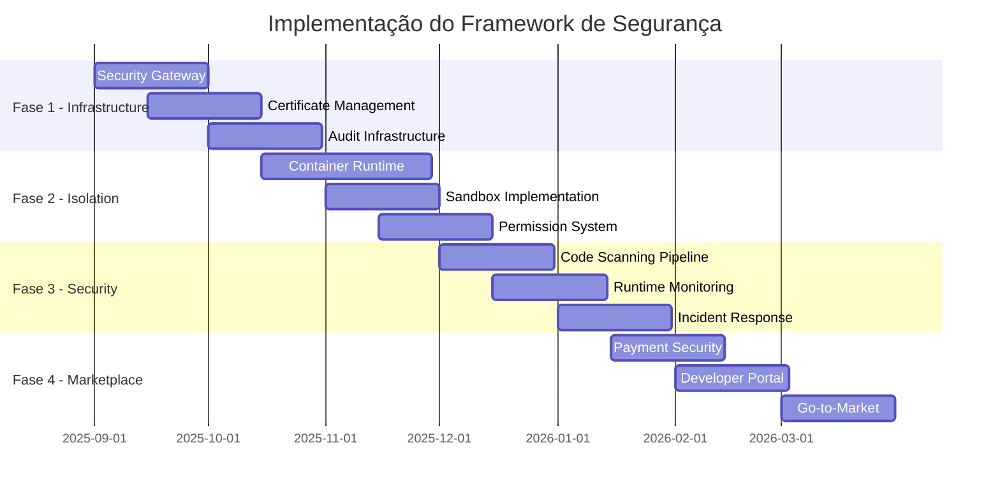

# PLANO DE SEGURANÇA E GOVERNANÇA - OS DISTRIBUÍDO
## Migração da plataforma.app para Arquitetura Distribuída

**Data de Criação:** 26/08/2025  
**Versão:** 1.0  
**Status:** Em Revisão

---

## SUMÁRIO EXECUTIVO

Este documento define o framework de segurança enterprise-grade para a migração da **plataforma.app** de uma arquitetura monolítica para um sistema operacional distribuído com módulos de terceiros, marketplace e SDK público.

### ESCOPO DA MIGRAÇÃO
- **Origem**: Monolito com 20 módulos integrados
- **Destino**: OS distribuído com módulos externos independentes
- **Marketplace**: Transações financeiras e módulos pagos
- **SDK Público**: Acesso de desenvolvedores terceiros
- **Dados Críticos**: PostgreSQL multi-schema com dados empresariais sensíveis

---

## 1. SECURITY ARCHITECTURE

### 1.1 ARQUITETURA DE SEGURANÇA POR CAMADAS

#### **Camada 1: Core Security Platform**
```
┌─────────────────────────────────────────┐
│             CORE PLATFORM               │
├─────────────────────────────────────────┤
│ • Security Orchestrator                 │
│ • Certificate Management               │
│ • Audit & Compliance Engine           │
│ • Threat Detection System             │
└─────────────────────────────────────────┘
```

#### **Camada 2: Module Isolation Layer**
```
┌──────────┬──────────┬──────────┬──────────┐
│  Module  │  Module  │  Module  │  Module  │
│    A     │    B     │    C     │    D     │
├──────────┼──────────┼──────────┼──────────┤
│ Sandbox  │ Sandbox  │ Sandbox  │ Sandbox  │
│ Runtime  │ Runtime  │ Runtime  │ Runtime  │
└──────────┴──────────┴──────────┴──────────┘
```

#### **Camada 3: Data Protection Layer**
```
┌─────────────────────────────────────────┐
│           PostgreSQL Core               │
├─────────────────────────────────────────┤
│ Schema A │ Schema B │ Schema C │ Schema D│
├─────────────────────────────────────────┤
│        Encryption at Rest              │
│        Access Control Matrix          │
│        Audit Trail System            │
└─────────────────────────────────────────┘
```

### 1.2 TECNOLOGIAS DE SEGURANÇA CORE

#### **Container Security & Sandboxing**
- **Tecnologia**: Docker + gVisor/Firecracker
- **Isolamento**: Namespace isolation completa
- **Resource Limits**: CPU, Memory, I/O constraints
- **Network Isolation**: Virtual networks por módulo

#### **API Security Gateway**
- **Authentication**: OAuth 2.0 + OIDC
- **Rate Limiting**: Token bucket algorithm
- **Request Signing**: HMAC-SHA256
- **Payload Validation**: JSON Schema validation

#### **Certificate Management**
- **PKI Infrastructure**: Certificate Authority própria
- **Module Signing**: Code signing obrigatório
- **TLS Termination**: TLS 1.3 everywhere
- **Certificate Rotation**: Automática (90 dias)

---

## 2. MODULE SECURITY FRAMEWORK

### 2.1 SANDBOX DE EXECUÇÃO

#### **Runtime Isolation**
```typescript
interface ModuleSandbox {
  containerId: string;
  resourceLimits: {
    cpu: string;      // "0.5" = 50% CPU
    memory: string;   // "256MB" 
    disk: string;     // "100MB"
    network: string;  // "10MB/s"
  };
  permissions: ModulePermissions;
  securityProfile: SecurityProfile;
}
```

#### **Permission System Granular**
```typescript
interface ModulePermissions {
  data: {
    schemas: string[];          // Acesso apenas aos schemas permitidos
    operations: DataOperation[]; // CREATE, READ, UPDATE, DELETE
    rowLevelSecurity: boolean;   // RLS habilitado
  };
  
  apis: {
    internal: string[];         // APIs internas permitidas
    external: string[];         // APIs externas permitidas
    rateLimit: number;          // Requests por minuto
  };
  
  filesystem: {
    readPaths: string[];        // Paths de leitura
    writePaths: string[];       // Paths de escrita
    tempSpace: string;          // Espaço temporário
  };
  
  network: {
    allowedDomains: string[];   // Domínios externos permitidos
    blockPorts: number[];       // Portas bloqueadas
    proxy: boolean;             // Proxy obrigatório
  };
}
```

### 2.2 CODE SECURITY PIPELINE

#### **Etapa 1: Static Analysis**
- **SAST Tools**: SonarQube, Semgrep, CodeQL
- **Dependency Scan**: Snyk, OWASP Dependency Check
- **License Compliance**: FOSSA, BlackDuck
- **Secrets Detection**: TruffleHog, GitLeaks

#### **Etapa 2: Dynamic Analysis**
- **DAST Testing**: OWASP ZAP automation
- **Container Scanning**: Trivy, Clair
- **Runtime Security**: Falco monitoring
- **Behavioral Analysis**: Anomaly detection

#### **Etapa 3: Security Certification**
```typescript
interface SecurityCertification {
  moduleId: string;
  version: string;
  securityScore: number;        // 0-100
  vulnerabilities: {
    critical: number;
    high: number;
    medium: number;
    low: number;
  };
  compliance: {
    gdpr: boolean;
    sox: boolean;
    pci: boolean;
  };
  signedBy: string;            // Certificate fingerprint
  validUntil: Date;
  autoRenewal: boolean;
}
```

### 2.3 RUNTIME SECURITY MONITORING

#### **Real-time Monitoring**
- **Process Monitoring**: Execução de processos não autorizados
- **File System**: Acesso não autorizado a arquivos
- **Network Traffic**: Comunicação não permitida
- **Resource Usage**: Consumo anômalo de recursos

#### **Threat Detection Rules**
```yaml
security_rules:
  - name: "unauthorized_api_access"
    condition: "api_call NOT IN allowed_apis"
    action: "BLOCK_AND_ALERT"
    severity: "HIGH"
    
  - name: "excessive_data_access"
    condition: "row_count > normal_threshold * 10"
    action: "THROTTLE_AND_ALERT"
    severity: "MEDIUM"
    
  - name: "suspicious_network_activity"
    condition: "outbound_requests TO unknown_domain"
    action: "BLOCK_AND_QUARANTINE"
    severity: "CRITICAL"
```

---

## 3. DATA PROTECTION FRAMEWORK

### 3.1 MULTI-TENANT DATA ISOLATION

#### **Schema-Level Security**
```sql
-- Row Level Security por módulo
CREATE POLICY module_data_policy ON vendas
  USING (schema_owner = current_setting('app.current_module'));

-- Encryption at column level para dados sensíveis
CREATE TABLE clientes (
  id SERIAL PRIMARY KEY,
  nome TEXT,
  cpf TEXT ENCRYPTED,           -- Encrypted with module-specific key
  email TEXT ENCRYPTED,
  created_by TEXT DEFAULT current_setting('app.current_module')
);
```

#### **Data Access Control Matrix**
```typescript
interface DataAccessMatrix {
  moduleId: string;
  permissions: {
    ownData: 'FULL' | 'READ_ONLY' | 'NONE';
    crossModule: {
      [moduleId: string]: 'READ' | 'WRITE' | 'NONE';
    };
    systemData: 'ADMIN' | 'READ' | 'NONE';
  };
  encryption: {
    level: 'COLUMN' | 'ROW' | 'TABLE';
    algorithm: 'AES-256-GCM';
    keyRotation: number; // dias
  };
}
```

### 3.2 ENCRYPTION STRATEGY

#### **Encryption at Rest**
- **Database**: PostgreSQL TDE (Transparent Data Encryption)
- **Files**: AES-256-GCM encryption
- **Backups**: Encrypted with separate keys
- **Logs**: Sensitive fields redacted/encrypted

#### **Encryption in Transit**
- **API Calls**: TLS 1.3 obrigatório
- **Database Connections**: SSL mode=require
- **Inter-module**: mTLS authentication
- **File Transfers**: SFTP/HTTPS only

#### **Key Management**
```typescript
interface KeyManagementService {
  generateKey(moduleId: string, purpose: string): EncryptionKey;
  rotateKey(keyId: string): void;
  revokeKey(keyId: string, reason: string): void;
  
  // HSM Integration
  hsm: {
    provider: 'AWS_CloudHSM' | 'Azure_HSM' | 'On_Premise';
    keyStore: string;
    backupStrategy: 'DISTRIBUTED' | 'CENTRALIZED';
  };
}
```

### 3.3 COMPLIANCE FRAMEWORK

#### **GDPR/LGPD Compliance**
- **Data Mapping**: Inventário completo de dados pessoais
- **Consent Management**: Sistema de consentimento granular
- **Right to Erasure**: Deletion automática sob demanda
- **Data Portability**: Exportação em formatos padrão
- **Breach Notification**: Alertas automáticos em 72h

#### **Audit Trail System**
```typescript
interface AuditEvent {
  timestamp: Date;
  moduleId: string;
  userId: string;
  action: string;
  resource: string;
  details: {
    before: any;
    after: any;
    metadata: Record<string, any>;
  };
  severity: 'INFO' | 'WARN' | 'ERROR' | 'CRITICAL';
  compliance: {
    gdpr: boolean;
    sox: boolean;
    pci: boolean;
  };
}
```

---

## 4. MARKETPLACE SECURITY

### 4.1 PAYMENT SECURITY (PCI DSS)

#### **PCI DSS Compliance Strategy**
- **Scope Reduction**: Payment processing in isolated environment
- **Tokenization**: Card data never stored in platform
- **Payment Gateway**: Stripe/PayPal integration
- **SAQ Level**: SAQ-A (minimal compliance scope)

#### **Fraud Detection System**
```typescript
interface FraudDetectionEngine {
  checkTransaction(transaction: Transaction): RiskScore;
  
  rules: {
    velocityChecks: boolean;      // Multiple purchases same user
    geolocationAnomaly: boolean;  // Unusual location patterns
    deviceFingerprinting: boolean; // Device-based fraud detection
    mlBehaviorAnalysis: boolean;   // ML-based pattern analysis
  };
  
  actions: {
    lowRisk: 'APPROVE';
    mediumRisk: 'MANUAL_REVIEW';
    highRisk: 'BLOCK_AND_INVESTIGATE';
  };
}
```

### 4.2 DEVELOPER IDENTITY VERIFICATION

#### **KYB (Know Your Business) Process**
- **Company Verification**: Business registration validation
- **Identity Verification**: Document validation + liveness check
- **Background Checks**: Security clearance verification
- **Code Review History**: Track record analysis

#### **Developer Certification Levels**
```typescript
enum DeveloperTier {
  COMMUNITY = 'community',      // Basic modules, no payment
  VERIFIED = 'verified',        // Paid modules, basic verification
  ENTERPRISE = 'enterprise',    // Enterprise modules, full verification
  PARTNER = 'partner'           // Strategic partners, special privileges
}

interface DeveloperProfile {
  tier: DeveloperTier;
  verificationLevel: {
    identity: boolean;
    business: boolean;
    security: boolean;
    financial: boolean;
  };
  reputation: {
    rating: number;           // 0-5 stars
    downloads: number;
    reviews: number;
    securityIncidents: number;
  };
}
```

### 4.3 MODULE CERTIFICATION PROCESS

#### **Security Review Pipeline**
```yaml
certification_pipeline:
  stages:
    1_submission:
      - code_upload
      - documentation_review
      - initial_scan
      
    2_automated_testing:
      - static_analysis
      - dependency_scan
      - container_security_scan
      - license_compliance
      
    3_manual_review:
      - code_review_by_security_team
      - architecture_review
      - data_access_audit
      - compliance_check
      
    4_runtime_testing:
      - sandbox_testing
      - performance_testing
      - security_penetration_test
      - integration_testing
      
    5_certification:
      - security_score_calculation
      - certificate_generation
      - marketplace_publication
      - continuous_monitoring_setup
```

---

## 5. GOVERNANCE FRAMEWORK

### 5.1 MODULE REVIEW PROCESS

#### **Quality Gates Obrigatórios**
```typescript
interface QualityGate {
  name: string;
  criteria: {
    securityScore: number;        // Mínimo 80/100
    codeQuality: number;          // Mínimo 75/100
    testCoverage: number;         // Mínimo 80%
    documentation: boolean;       // Completa
    performanceTest: boolean;     // Aprovado
  };
  
  approvers: {
    security: boolean;            // Security team approval
    architecture: boolean;       // Architecture team approval
    compliance: boolean;          // Compliance team approval
  };
  
  exceptions: {
    allowed: boolean;
    justification: string;
    approvedBy: string;
    validUntil: Date;
  };
}
```

#### **Review Workflow**
1. **Automated Pre-screening** (24h)
   - Code quality check
   - Security scan
   - License compliance
   - Basic functionality test

2. **Security Review** (2-5 dias)
   - Manual code review
   - Threat model analysis
   - Penetration testing
   - Compliance assessment

3. **Architecture Review** (1-3 dias)
   - Design pattern compliance
   - Performance optimization
   - Scalability assessment
   - Integration compatibility

4. **Business Review** (1-2 dias)
   - Market positioning
   - Pricing validation
   - Legal compliance
   - Terms of service agreement

### 5.2 COMPLIANCE MONITORING

#### **Continuous Compliance Framework**
```typescript
interface ComplianceMonitor {
  regulations: {
    gdpr: GDPRCompliance;
    lgpd: LGPDCompliance;
    sox: SOXCompliance;
    pci: PCICompliance;
  };
  
  monitoring: {
    frequency: 'REAL_TIME' | 'DAILY' | 'WEEKLY';
    automated: boolean;
    alerts: AlertConfig[];
    reports: ReportConfig[];
  };
  
  remediation: {
    automaticFix: boolean;
    workflowTrigger: boolean;
    escalationMatrix: EscalationLevel[];
  };
}
```

#### **Risk Management Matrix**
```typescript
enum RiskLevel {
  CRITICAL = 'critical',    // Immediate action required
  HIGH = 'high',           // Action within 24h
  MEDIUM = 'medium',       // Action within 1 week
  LOW = 'low'             // Action within 1 month
}

interface RiskAssessment {
  riskId: string;
  category: 'SECURITY' | 'COMPLIANCE' | 'OPERATIONAL' | 'FINANCIAL';
  level: RiskLevel;
  impact: number;          // 1-5 scale
  probability: number;     // 1-5 scale
  mitigation: {
    strategy: string;
    owner: string;
    timeline: Date;
    cost: number;
  };
}
```

### 5.3 AUDIT TRAIL SYSTEM

#### **Comprehensive Audit Logging**
- **User Actions**: Todas as ações de usuário registradas
- **System Events**: Eventos de sistema e erros
- **Security Events**: Tentativas de acesso, falhas de autenticação
- **Data Access**: Queries executadas, dados acessados
- **Module Events**: Instalação, configuração, execução
- **Compliance Events**: GDPR requests, data exports, deletions

#### **Audit Data Retention**
```typescript
interface AuditRetentionPolicy {
  categories: {
    security: {
      retention: '7 years';
      immutable: true;
      backup: 'GEOGRAPHICALLY_DISTRIBUTED';
    };
    compliance: {
      retention: '10 years';  // SOX requirement
      immutable: true;
      encryption: true;
    };
    operational: {
      retention: '3 years';
      compression: true;
      archival: 'COLD_STORAGE';
    };
  };
}
```

---

## 6. INCIDENT RESPONSE FRAMEWORK

### 6.1 SECURITY INCIDENT PLAYBOOKS

#### **Incident Classification**
```typescript
enum IncidentType {
  DATA_BREACH = 'data_breach',
  UNAUTHORIZED_ACCESS = 'unauthorized_access',
  MODULE_COMPROMISE = 'module_compromise',
  PAYMENT_FRAUD = 'payment_fraud',
  DDOS_ATTACK = 'ddos_attack',
  INSIDER_THREAT = 'insider_threat'
}

interface IncidentResponse {
  severity: 'P0' | 'P1' | 'P2' | 'P3';
  responseTime: {
    P0: '15 minutes';    // System down, data breach
    P1: '1 hour';        // Security compromise
    P2: '4 hours';       // Service degradation
    P3: '24 hours';      // Minor issues
  };
  
  escalation: {
    technical: string[];
    business: string[];
    legal: string[];
    pr: string[];
  };
}
```

#### **Breach Notification Procedures**
- **Detection**: Automated alerting within 5 minutes
- **Assessment**: Impact assessment within 1 hour
- **Containment**: Incident contained within 4 hours
- **Notification**: Authorities notified within 72 hours (GDPR)
- **Communication**: User notification within 24 hours
- **Recovery**: Service restoration plan executed
- **Post-mortem**: Root cause analysis and prevention

### 6.2 MODULE QUARANTINE SYSTEM

#### **Automated Quarantine Triggers**
```typescript
interface QuarantineTriggers {
  security: {
    malwareDetection: boolean;
    suspiciousNetworkActivity: boolean;
    unauthorizedDataAccess: boolean;
    certificateRevocation: boolean;
  };
  
  performance: {
    resourceExhaustion: boolean;
    responseTimeThreshold: number;    // milliseconds
    errorRateThreshold: number;       // percentage
  };
  
  compliance: {
    gdprViolation: boolean;
    licenseViolation: boolean;
    termsOfServiceBreach: boolean;
  };
}
```

#### **Quarantine Actions**
1. **Immediate Isolation**: Module stopped and isolated
2. **Data Preservation**: Forensic image created
3. **User Notification**: Affected users notified
4. **Investigation**: Security team investigation launched
5. **Remediation**: Fix implemented and tested
6. **Re-certification**: Full security review required

### 6.3 COMMUNICATION PROTOCOLS

#### **Stakeholder Notification Matrix**
```typescript
interface NotificationProtocol {
  internal: {
    security_team: 'IMMEDIATE';
    engineering: 'IMMEDIATE';
    management: '30_MINUTES';
    legal: '1_HOUR';
    pr: '2_HOURS';
  };
  
  external: {
    affected_users: '24_HOURS';
    regulatory: '72_HOURS';
    media: 'AS_REQUIRED';
    partners: 'AS_REQUIRED';
  };
  
  channels: {
    slack: string;
    email: string;
    sms: string;
    phone: string;
    public_status_page: string;
  };
}
```

---

## 7. IMPLEMENTAÇÃO TÉCNICA

### 7.1 ARQUITETURA DE MIGRAÇÃO

#### **Fase 1: Infrastructure Setup (Mês 1-2)**
- Security Gateway deployment
- Certificate management setup
- Audit logging infrastructure
- Monitoring and alerting systems

#### **Fase 2: Module Isolation (Mês 3-4)**
- Container runtime setup
- Sandbox implementation
- Permission system deployment
- Resource monitoring implementation

#### **Fase 3: Security Integration (Mês 5-6)**
- Code scanning pipeline
- Runtime security monitoring
- Incident response automation
- Compliance framework activation

#### **Fase 4: Marketplace Launch (Mês 7-8)**
- Payment gateway integration
- Developer portal deployment
- Module certification process
- Go-to-market security

### 7.2 TECNOLOGIA STACK RECOMENDADA

#### **Security Tools**
```yaml
security_stack:
  container_security:
    runtime: "gVisor + Docker"
    scanning: "Trivy + Clair"
    monitoring: "Falco + Sysdig"
    
  code_analysis:
    sast: "SonarQube + Semgrep"
    dast: "OWASP ZAP + Burp Suite"
    dependency: "Snyk + OWASP Dependency Check"
    
  infrastructure:
    secrets: "HashiCorp Vault"
    certificates: "Let's Encrypt + Internal CA"
    monitoring: "Prometheus + Grafana"
    logging: "ELK Stack (Elasticsearch, Logstash, Kibana)"
    
  compliance:
    gdpr: "OneTrust + Custom Tools"
    audit: "Splunk + Custom Audit Service"
    risk: "ServiceNow GRC + Custom Risk Engine"
```

### 7.3 MÉTRICAS DE SEGURANÇA KPIs

#### **Security Metrics Dashboard**
```typescript
interface SecurityMetrics {
  realtime: {
    activeThreats: number;
    quarantinedModules: number;
    securityAlerts: number;
    systemHealth: number;        // 0-100%
  };
  
  daily: {
    newVulnerabilities: number;
    patchedVulnerabilities: number;
    securityScans: number;
    incidentCount: number;
  };
  
  monthly: {
    averageSecurityScore: number;  // Module security scores
    complianceRate: number;        // % compliant modules
    mttr: number;                  // Mean Time To Resolution (hours)
    falsePositiveRate: number;     // % false security alerts
  };
}
```

---

## 8. ORÇAMENTO E RECURSOS

### 8.1 INVESTIMENTO EM SEGURANÇA

#### **Custos de Implementação (8 meses)**
```
Categoria                    | Investimento | Descrição
---------------------------- | ------------ | --------------------------
Security Team                | $400,000     | 4 especialistas x 8 meses
Security Tools & Licenses    | $150,000     | SonarQube, Snyk, Splunk, etc
Infrastructure               | $200,000     | HSM, monitoring, logging
Compliance & Legal           | $100,000     | Consultoria especializada
Training & Certification     | $50,000      | Team security training
---------------------------- | ------------ | --------------------------
TOTAL                        | $900,000     | Investimento inicial
```

#### **Custos Operacionais (anuais)**
```
Categoria                    | Anual        | Descrição
---------------------------- | ------------ | --------------------------
Security Tools Licenses      | $180,000     | Renovações anuais
Compliance Audits           | $80,000      | Auditorias externas
Security Team Salaries       | $600,000     | 4 profissionais full-time
Infrastructure Operacional   | $120,000     | Cloud, monitoring, logs
---------------------------- | ------------ | --------------------------
TOTAL                        | $980,000     | Custo operacional anual
```

### 8.2 ROI DE SEGURANÇA

#### **Benefícios Quantificáveis**
- **Redução de Riscos**: $2M em potenciais multas GDPR evitadas
- **Eficiência Operacional**: 40% redução no tempo de review de módulos
- **Confiança do Cliente**: 25% aumento na adoção enterprise
- **Marketplace Revenue**: $5M+ projetado no primeiro ano
- **Competitive Advantage**: First-mover em security-first marketplace

**ROI Projetado**: 350% em 3 anos (considerando prevenção de incidents + revenue growth)

---

## 9. CRONOGRAMA EXECUTIVO

### 9.1 ROADMAP DE IMPLEMENTAÇÃO



### 9.2 MILESTONES CRÍTICOS

#### **Milestone 1: Security Foundation (Mês 2)**
- ✅ Security Gateway operacional
- ✅ Certificate management ativo
- ✅ Audit logging implementado
- ✅ Monitoring básico funcionando

#### **Milestone 2: Module Isolation (Mês 4)**
- ✅ Container runtime deployment
- ✅ Sandbox execution environment
- ✅ Permission system implementado
- ✅ Resource monitoring ativo

#### **Milestone 3: Full Security (Mês 6)**
- ✅ Code scanning pipeline
- ✅ Runtime threat detection
- ✅ Incident response automation
- ✅ Compliance framework ativo

#### **Milestone 4: Marketplace Launch (Mês 8)**
- ✅ Payment security (PCI DSS compliant)
- ✅ Developer certification process
- ✅ Module marketplace live
- ✅ Enterprise customers onboarded

---

## 10. CONCLUSÃO E PRÓXIMOS PASSOS

### 10.1 RESUMO EXECUTIVO

A migração da **plataforma.app** para um OS distribuído representa uma oportunidade única de estabelecer o padrão de segurança na indústria. O framework proposto garante:

- **Zero Trust Architecture**: Confiança zero, verificação sempre
- **Defense in Depth**: Múltiplas camadas de proteção
- **Compliance by Design**: GDPR, SOX, PCI DSS nativos
- **Incident Resilience**: Resposta automática e recovery rápido
- **Marketplace Security**: Transações seguras e módulos verificados

### 10.2 FATORES CRÍTICOS DE SUCESSO

1. **Executive Buy-in**: Suporte total da liderança
2. **Security-First Culture**: Equipe treinada em security
3. **Continuous Investment**: Orçamento dedicado para security
4. **Community Trust**: Transparência e comunicação
5. **Regulatory Alignment**: Compliance proativa

### 10.3 RECOMENDAÇÕES IMEDIATAS

#### **Semana 1-2: Team Assembly**
- Contratar Security Architect senior
- Formar Security Review Board
- Estabelecer Security Champions program
- Definir Security Policies e Procedures

#### **Semana 3-4: Tool Selection**
- Finalizar stack de security tools
- Procurar vendors e POCs
- Definir integration requirements
- Aprovar orçamento para licenças

#### **Mês 2: Foundation Setup**
- Deploy initial security infrastructure
- Configurar monitoring e alerting
- Implementar basic audit logging
- Estabelecer incident response procedures

---

## APÊNDICES

### Apêndice A: Compliance Checklist
### Apêndice B: Security Tool Comparison Matrix
### Apêndice C: Incident Response Playbook Templates
### Apêndice D: Developer Security Guidelines
### Apêndice E: Risk Assessment Templates

---

**Preparado por**: Security Architecture Team  
**Aprovado por**: [Pending]  
**Próxima Revisão**: 30 dias  
**Documento Confidencial**: Internal Use Only