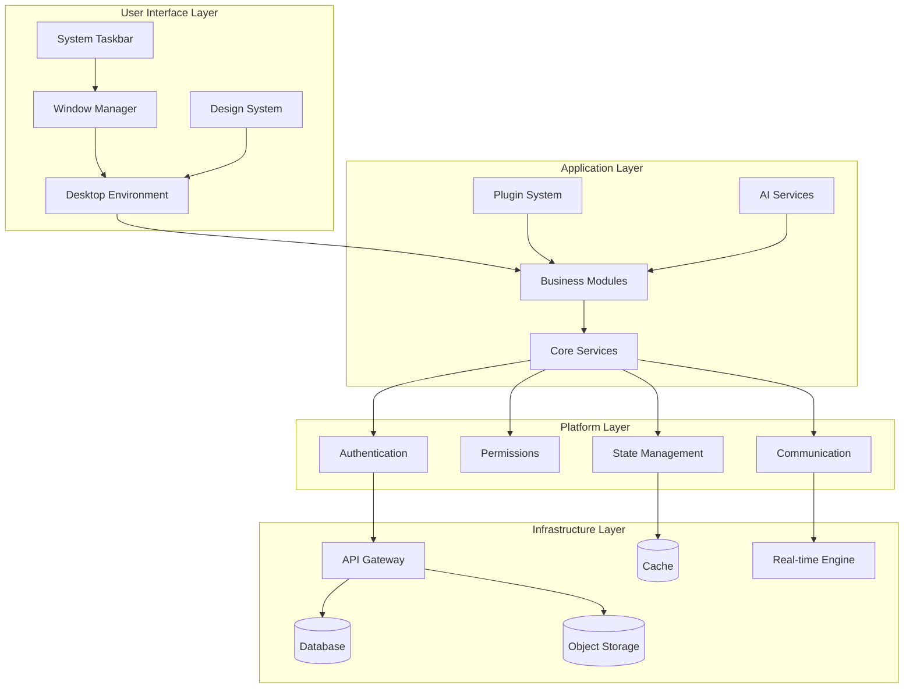
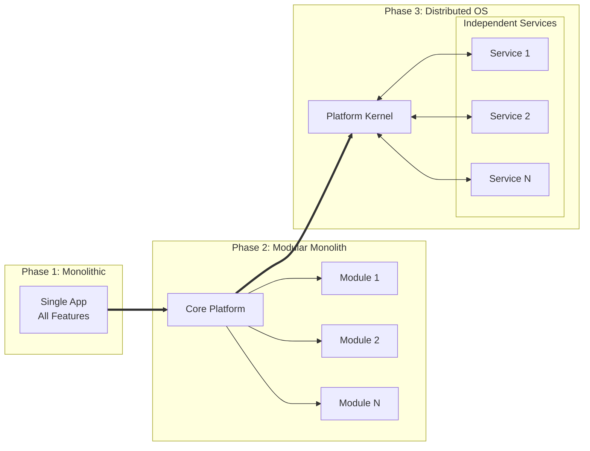
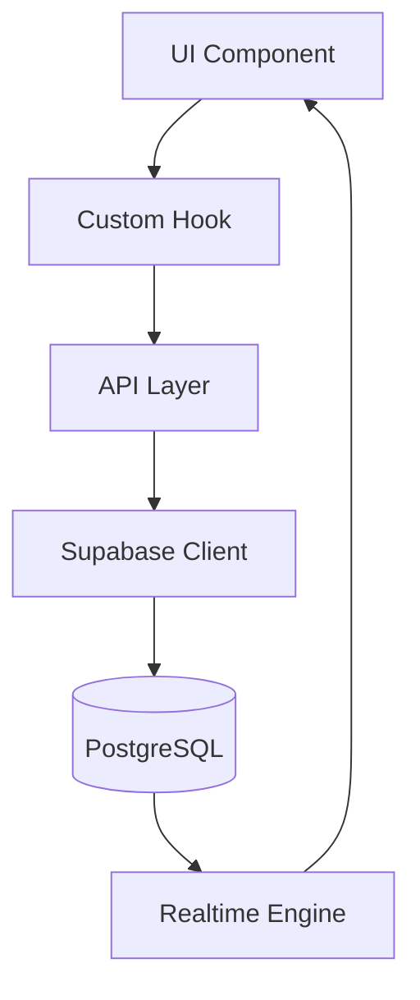
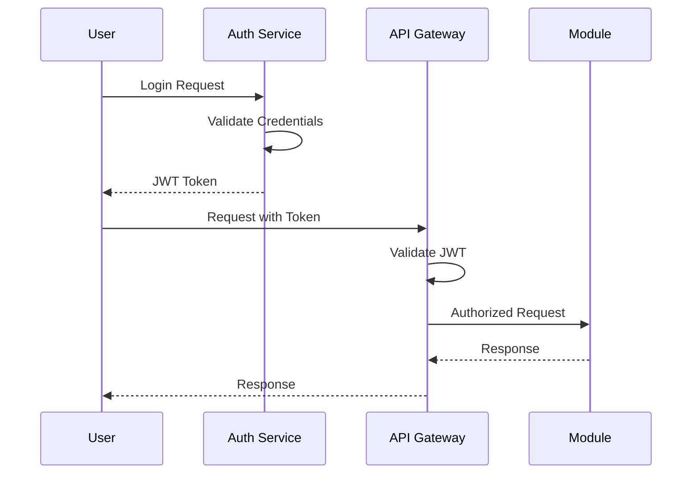
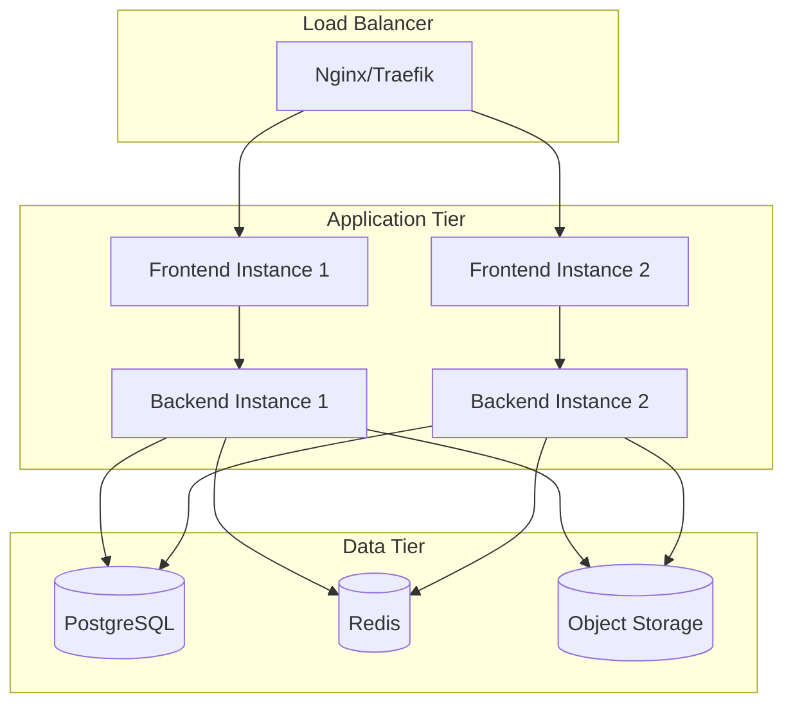
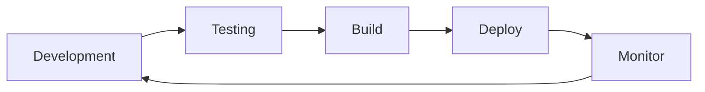

# Plataforma.dev Architecture Documentation

This document provides a comprehensive overview of the Plataforma.dev system architecture, including the migration from monolithic to distributed OS architecture.

## 📋 Table of Contents

- [System Overview](#system-overview)
- [Architecture Evolution](#architecture-evolution)
- [Core Components](#core-components)
- [Module System](#module-system)
- [Data Architecture](#data-architecture)
- [Security Architecture](#security-architecture)
- [Communication Patterns](#communication-patterns)
- [Deployment Architecture](#deployment-architecture)
- [Performance & Scalability](#performance--scalability)

## 🎯 System Overview

Plataforma.dev is architected as a **distributed operating system** that runs in the browser, providing a desktop-like experience for enterprise applications.

### High-Level Architecture



### Key Architectural Principles

1. **Modular Design**: Each business domain is a separate, self-contained module
2. **Event-Driven**: Loose coupling through event-based communication
3. **Real-time First**: All data changes propagate in real-time
4. **Security by Design**: Role-based access control at every layer
5. **Developer Experience**: Easy to extend and customize
6. **Cloud Native**: Designed for containerized deployment

## 🔄 Architecture Evolution

### Phase 1: Monolithic (Legacy)
- Single application with all modules bundled
- Shared database with mixed concerns
- Tight coupling between components
- Difficult to scale and maintain

### Phase 2: Modular Monolith (Current)
- Logical separation of modules
- Shared runtime with module isolation
- Centralized authentication and permissions
- Easier development and testing

### Phase 3: Distributed OS (Target)
- Each module runs as independent service
- Event-driven communication
- Distributed authentication
- Microservices architecture



## 🧩 Core Components

### 1. Window Management System
**Location**: `packages/core-window-system/`

Provides desktop-like window management:
- Floating, resizable windows
- Window states (minimized, maximized, normal)
- Z-index management
- Window persistence
- Multi-desktop support

```typescript
interface WindowState {
  id: string;
  title: string;
  component: ComponentType;
  position: { x: number; y: number };
  size: { width: number; height: number };
  zIndex: number;
  isMinimized: boolean;
  isMaximized: boolean;
}
```

### 2. Design System
**Location**: `packages/design-system/`

Glassmorphism-based design system:
- Consistent visual language
- Accessibility-first components
- Theme support (dark/light)
- Component variants and tokens

```typescript
// Design tokens
export const glassmorphism = {
  background: 'bg-white/5 backdrop-blur-xl',
  border: 'border border-white/10',
  hover: 'hover:bg-white/10',
};
```

### 3. Authentication System
**Location**: `packages/auth-system/`

Enterprise-grade authentication:
- JWT-based authentication
- Role-based access control (RBAC)
- Social login integration
- Session management
- Multi-factor authentication

### 4. Module System
**Location**: `packages/module-contracts/`

Defines how modules interact:
- Module manifest specifications
- API contracts and interfaces
- Dependency management
- Lifecycle management
- Communication protocols

## 📦 Module System

### Module Types

1. **Core Modules**: Essential system functionality
   - Authentication (`packages/auth-system/`)
   - Window Management (`packages/core-window-system/`)
   - Design System (`packages/design-system/`)

2. **Business Modules**: Domain-specific functionality
   - Sales & CRM
   - Finance & Accounting
   - Human Resources
   - Inventory Management

3. **Plugin Modules**: Third-party extensions
   - Custom integrations
   - Specialized tools
   - Industry-specific features

### Module Structure

```
module-name/
├── package.json              # Module manifest
├── src/
│   ├── components/          # UI components
│   ├── services/           # Business logic
│   ├── hooks/              # React hooks
│   ├── types/              # TypeScript types
│   └── index.ts            # Module entry point
├── assets/                 # Static assets
└── docs/                   # Module documentation
```

### Module Communication

Modules communicate through:
1. **Direct API calls** - For synchronous operations
2. **Events** - For asynchronous notifications
3. **Shared state** - For collaborative data
4. **Message passing** - For complex interactions

```typescript
// Module communication example
interface ModuleAPI {
  // Direct method calls
  invoke(method: string, params: any): Promise<any>;
  
  // Event subscription
  on(event: string, handler: Function): void;
  off(event: string, handler: Function): void;
  
  // Event emission
  emit(event: string, data: any): void;
  
  // Shared state access
  getState(key: string): any;
  setState(key: string, value: any): void;
}
```

## 🗄️ Data Architecture

### Database Design

**Primary Database**: PostgreSQL with Supabase
- **Multi-schema approach**: One schema per module
- **Real-time subscriptions**: Automatic UI updates
- **Row Level Security (RLS)**: Fine-grained permissions
- **TEXT + Type Hints system**: Flexible data storage

```sql
-- Example schema structure
CREATE SCHEMA vendas;
CREATE SCHEMA financeiro;
CREATE SCHEMA estoque;

-- Column metadata for type hints
CREATE TABLE plataforma_core.column_metadata (
  schema_name TEXT,
  table_name TEXT,
  column_name TEXT,
  type_hint TEXT, -- 'currency', 'date', 'cpf', etc.
  display_options JSONB
);
```

### Data Flow



### Cache Strategy

1. **Browser Cache**: Component-level caching
2. **Query Cache**: TanStack Query for API responses
3. **Real-time Cache**: Supabase real-time subscriptions
4. **Redis Cache**: Server-side caching for performance

## 🔒 Security Architecture

### Authentication Flow



### Security Layers

1. **Transport Security**: HTTPS/WSS encryption
2. **Authentication**: JWT tokens with refresh
3. **Authorization**: Role-based access control
4. **Data Security**: Row-level security in database
5. **Input Validation**: Server-side validation
6. **Audit Logging**: All actions tracked

### Permission Model

```typescript
interface Permission {
  resource: string;      // 'sales', 'finance', 'users'
  action: string;        // 'read', 'write', 'delete'
  scope: 'own' | 'team' | 'all';
  conditions?: object;   // Additional conditions
}

interface Role {
  name: string;
  permissions: Permission[];
  inheritance?: string[]; // Inherit from other roles
}
```

## 🔄 Communication Patterns

### 1. Request-Response
Standard HTTP API calls for CRUD operations

### 2. Event-Driven
Real-time events for collaborative features
```typescript
// Event examples
events.emit('table.updated', { table: 'users', id: '123' });
events.emit('user.login', { userId: '456' });
events.emit('module.activated', { module: 'sales' });
```

### 3. Real-time Subscriptions
Database changes propagated via WebSockets
```typescript
const subscription = supabase
  .channel('table-changes')
  .on('postgres_changes', 
     { event: '*', schema: 'public' }, 
     payload => updateUI(payload)
  );
```

### 4. Inter-Module Communication
Modules communicate through the platform kernel
```typescript
// Module A requests data from Module B
const result = await platform.modules.get('finance')
  .invoke('getBalance', { accountId: '123' });
```

## 🚀 Deployment Architecture

### Container Architecture



### Kubernetes Deployment

**Namespace Structure**:
- `plataforma-system`: Core platform services
- `plataforma-modules`: Business modules
- `plataforma-data`: Database and cache services

**Resource Allocation**:
```yaml
# Example deployment configuration
apiVersion: apps/v1
kind: Deployment
metadata:
  name: plataforma-frontend
spec:
  replicas: 3
  template:
    spec:
      containers:
      - name: frontend
        image: plataforma/frontend:latest
        resources:
          requests:
            memory: "256Mi"
            cpu: "100m"
          limits:
            memory: "512Mi"
            cpu: "500m"
```

### Environment Configuration

- **Development**: Single-node deployment with hot reload
- **Staging**: Multi-node with production-like data
- **Production**: High-availability with load balancing

## ⚡ Performance & Scalability

### Frontend Performance

1. **Code Splitting**: Lazy loading of modules
2. **Bundle Optimization**: Tree shaking and minification
3. **Caching**: Aggressive caching of static assets
4. **Virtualization**: Virtual scrolling for large datasets

### Backend Scalability

1. **Horizontal Scaling**: Multiple backend instances
2. **Database Optimization**: Proper indexing and queries
3. **Caching**: Multi-level caching strategy
4. **Async Processing**: Background job processing

### Monitoring & Observability

- **Metrics**: Prometheus + Grafana
- **Logging**: ELK Stack (Elasticsearch, Logstash, Kibana)
- **Tracing**: Distributed tracing for request flow
- **Alerts**: Automated alerting for system issues

### Performance Targets

| Metric | Target | Current |
|--------|--------|---------|
| First Contentful Paint | < 1.5s | ~1.2s |
| Time to Interactive | < 3s | ~2.8s |
| API Response Time | < 200ms | ~150ms |
| Database Query Time | < 50ms | ~35ms |

## 🛠️ Development Architecture

### Build System

- **Frontend**: Vite for fast development and building
- **Backend**: SWC for TypeScript compilation
- **Packages**: Turborepo for monorepo management

### Testing Strategy

1. **Unit Tests**: Jest for business logic
2. **Integration Tests**: Testing Library for components
3. **E2E Tests**: Playwright for user workflows
4. **Performance Tests**: Lighthouse CI

### CI/CD Pipeline



## 🔮 Future Architecture

### Planned Enhancements

1. **Micro-frontends**: Independent module deployment
2. **Edge Computing**: CDN-based module distribution  
3. **AI Integration**: Embedded AI services in modules
4. **Blockchain**: Decentralized authentication option
5. **PWA**: Offline-first capabilities

### Migration Timeline

- **Q1 2025**: Complete modular monolith refactor
- **Q2 2025**: Begin micro-service extraction
- **Q3 2025**: Distributed authentication system
- **Q4 2025**: Full distributed OS deployment

---

This architecture documentation will be updated as the system evolves. For questions or clarifications, please refer to the [API Reference](./API_REFERENCE.md) or contact the development team.