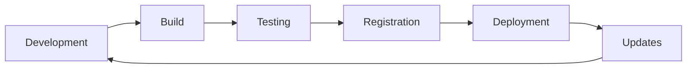

# Module Development Guide

This comprehensive guide covers everything you need to know about creating, developing, and publishing modules for Plataforma.dev.

## 📋 Table of Contents

- [Module System Overview](#module-system-overview)
- [Module Types](#module-types)
- [Getting Started](#getting-started)
- [Module Architecture](#module-architecture)
- [Development Workflow](#development-workflow)
- [Best Practices](#best-practices)
- [Testing Modules](#testing-modules)
- [Publishing Modules](#publishing-modules)
- [Advanced Topics](#advanced-topics)

## 🎯 Module System Overview

Plataforma.dev uses a sophisticated module system that allows for:
- **Independent Development**: Each module can be developed and deployed separately
- **Hot Reloading**: Modules can be updated without system restart
- **Dependency Management**: Automatic resolution of module dependencies
- **Permission Control**: Fine-grained access control per module
- **Event Communication**: Inter-module communication through events

### Module Lifecycle



## 📦 Module Types

### 1. Business Modules
Domain-specific functionality for enterprise operations:
- **Sales & CRM**: Customer management, pipeline tracking
- **Finance**: Accounting, budgeting, reporting
- **HR**: Employee management, payroll, performance
- **Inventory**: Stock management, procurement

**Example Structure**:
```
sales-module/
├── src/
│   ├── components/
│   │   ├── CustomerList.tsx
│   │   ├── SalesForm.tsx
│   │   └── Dashboard.tsx
│   ├── services/
│   │   ├── customerService.ts
│   │   └── salesApi.ts
│   └── types/
│       └── index.ts
├── assets/
├── package.json
└── module.json
```

### 2. System Modules
Core platform functionality:
- **Authentication**: User login, permissions
- **Database**: Data management interface
- **Settings**: Configuration management
- **Notifications**: Alert system

### 3. Plugin Modules
Third-party extensions:
- **Integrations**: External service connectors
- **Utilities**: Helper tools and widgets
- **Themes**: Custom UI themes
- **Analytics**: Reporting and dashboards

### 4. AI-Powered Modules
Modules with built-in artificial intelligence:
- **Document Processing**: OCR, text analysis
- **Chatbots**: Intelligent conversation interfaces
- **Predictive Analytics**: Machine learning models
- **Automation**: Smart workflow engines

## 🚀 Getting Started

### Prerequisites
- Plataforma.dev development environment setup
- Node.js v18+ and npm
- Understanding of React and TypeScript
- Familiarity with the platform architecture

### Using the SDK

#### 1. Install the SDK
```bash
npm install -g @plataforma/sdk
```

#### 2. Create a New Module
```bash
# Create basic module
plataforma create-module my-sales-module

# Create AI-powered module
plataforma create-module my-ai-module --template=ai-powered

# Create plugin module
plataforma create-module my-plugin --template=plugin
```

#### 3. Module Templates

**Basic Module Template**:
```typescript
// src/components/ModuleComponent.tsx
import { WindowCard, WindowButton } from '@plataforma/design-system';
import { useModuleData } from '../hooks/useModuleData';

export default function MyModule() {
  const { data, loading, error } = useModuleData();

  if (loading) return <div>Loading...</div>;
  if (error) return <div>Error: {error.message}</div>;

  return (
    <WindowCard title="My Sales Module">
      <div className="p-4 space-y-4">
        <h2 className="text-xl font-semibold">Sales Dashboard</h2>
        
        <div className="grid grid-cols-2 gap-4">
          <div className="bg-white/10 p-4 rounded-lg">
            <h3>Total Sales</h3>
            <p className="text-2xl font-bold">${data?.totalSales}</p>
          </div>
          
          <div className="bg-white/10 p-4 rounded-lg">
            <h3>Active Customers</h3>
            <p className="text-2xl font-bold">{data?.customerCount}</p>
          </div>
        </div>

        <WindowButton 
          variant="primary" 
          onClick={() => console.log('New sale')}
        >
          New Sale
        </WindowButton>
      </div>
    </WindowCard>
  );
}
```

### 4. Module Configuration

**package.json**:
```json
{
  "name": "@my-company/sales-module",
  "version": "1.0.0",
  "main": "dist/index.js",
  "module": "dist/index.esm.js",
  "types": "dist/index.d.ts",
  "peerDependencies": {
    "react": "^18.0.0",
    "@plataforma/design-system": "^1.0.0"
  }
}
```

**module.json** (Module Manifest):
```json
{
  "id": "sales-module",
  "name": "Sales Management",
  "version": "1.0.0",
  "description": "Complete sales and CRM management solution",
  "category": "business",
  "icon": "shopping-cart",
  "author": {
    "name": "Your Company",
    "email": "developer@yourcompany.com"
  },
  "permissions": {
    "required": ["sales.read", "customers.read"],
    "optional": ["sales.write", "customers.write", "reports.read"]
  },
  "dependencies": {
    "modules": ["auth-system", "database-system"],
    "services": ["notification-service"]
  },
  "config": {
    "defaultSettings": {
      "currency": "USD",
      "dateFormat": "MM/dd/yyyy"
    }
  },
  "api": {
    "endpoints": ["/api/sales", "/api/customers"],
    "events": ["sale.created", "customer.updated"]
  }
}
```

## 🏗️ Module Architecture

### Component Structure

Follow the established pattern for consistent module architecture:

```
src/
├── components/           # UI Components
│   ├── ModuleComponent.tsx      # Main module component
│   ├── CustomerList.tsx         # Feature components
│   ├── SalesForm.tsx           # Form components
│   └── modals/                 # Modal components
│       └── CustomerModal.tsx
├── hooks/               # Custom hooks
│   ├── useModuleData.ts        # Data fetching
│   ├── useCustomers.ts         # Domain-specific logic
│   └── useSalesForm.ts         # Form logic
├── services/            # API and business logic
│   ├── customerService.ts      # API calls
│   ├── salesCalculations.ts    # Business logic
│   └── dataTransformers.ts     # Data processing
├── types/               # TypeScript definitions
│   ├── index.ts               # Exported types
│   ├── customer.ts            # Domain types
│   └── api.ts                 # API types
├── utils/               # Utility functions
│   ├── formatters.ts          # Data formatters
│   ├── validators.ts          # Input validation
│   └── constants.ts           # Module constants
├── styles/              # Module-specific styles
│   └── module.css
└── index.ts             # Module entry point
```

### Module Entry Point

```typescript
// src/index.ts
import { ModuleDefinition } from '@plataforma/module-contracts';
import ModuleComponent from './components/ModuleComponent';
import { customerService } from './services/customerService';

const moduleDefinition: ModuleDefinition = {
  id: 'sales-module',
  name: 'Sales Management',
  component: ModuleComponent,
  
  // Module lifecycle hooks
  async onActivate() {
    console.log('Sales module activated');
    await customerService.initialize();
  },
  
  async onDeactivate() {
    console.log('Sales module deactivated');
    customerService.cleanup();
  },
  
  // API exposed to other modules
  api: {
    getCustomers: customerService.getCustomers,
    createSale: customerService.createSale,
    
    // Event handlers
    on: (event: string, handler: Function) => {
      // Event subscription logic
    }
  }
};

export default moduleDefinition;
```

### Using Design System Components

Always use the platform's design system for consistency:

```typescript
import {
  WindowCard,
  WindowButton,
  WindowInput,
  WindowTable,
  WindowModal,
  WindowToast
} from '@plataforma/design-system';

// Consistent glassmorphism styling
<WindowCard 
  title="Customer Details" 
  className="backdrop-blur-xl bg-white/5"
>
  <WindowInput
    label="Customer Name"
    placeholder="Enter customer name"
    value={customerName}
    onChange={setCustomerName}
  />
  
  <WindowButton 
    variant="primary"
    onClick={handleSave}
  >
    Save Customer
  </WindowButton>
</WindowCard>
```

## 🔄 Development Workflow

### 1. Local Development

```bash
# Start development server
npm run dev

# In another terminal, start your module
cd my-sales-module
npm run dev

# Module will hot-reload on changes
```

### 2. Module Registration

Register your module in the platform:

```typescript
// In your main app
import { registerModule } from '@plataforma/core';
import salesModule from './modules/sales-module';

registerModule(salesModule);
```

### 3. Database Schema

If your module needs database tables:

```sql
-- Create module-specific schema
CREATE SCHEMA sales;

-- Create tables with RLS
CREATE TABLE sales.customers (
  id UUID PRIMARY KEY DEFAULT gen_random_uuid(),
  name TEXT NOT NULL,
  email TEXT UNIQUE,
  created_at TIMESTAMP DEFAULT NOW(),
  user_id UUID REFERENCES auth.users(id)
);

-- Enable RLS
ALTER TABLE sales.customers ENABLE ROW LEVEL SECURITY;

-- Create policies
CREATE POLICY "Users can only see their customers" 
  ON sales.customers FOR SELECT 
  USING (auth.uid() = user_id);
```

### 4. API Endpoints

Create dedicated API endpoints for your module:

```typescript
// server/routes/sales.ts
import express from 'express';
import { authenticate, authorize } from '../middleware/auth';

const router = express.Router();

// Get customers
router.get('/customers', 
  authenticate, 
  authorize('sales.read'),
  async (req, res) => {
    // Implementation
  }
);

// Create customer
router.post('/customers',
  authenticate,
  authorize('sales.write'),
  async (req, res) => {
    // Implementation
  }
);

export default router;
```

### 5. Real-time Updates

Implement real-time functionality:

```typescript
// In your module component
import { useRealtime } from '@plataforma/core';

export function CustomerList() {
  const [customers, setCustomers] = useState([]);
  
  // Subscribe to real-time updates
  useRealtime('sales.customers', {
    onInsert: (customer) => {
      setCustomers(prev => [...prev, customer]);
      WindowToast.success('New customer added!');
    },
    onUpdate: (customer) => {
      setCustomers(prev => 
        prev.map(c => c.id === customer.id ? customer : c)
      );
    },
    onDelete: (customer) => {
      setCustomers(prev => 
        prev.filter(c => c.id !== customer.id)
      );
    }
  });

  return (
    <WindowTable
      data={customers}
      columns={[
        { key: 'name', label: 'Name' },
        { key: 'email', label: 'Email' },
        { key: 'created_at', label: 'Created' }
      ]}
    />
  );
}
```

## 💡 Best Practices

### 1. Code Organization

```typescript
// ✅ Good: Clear separation of concerns
const CustomerService = {
  async getCustomers() { /* API call */ },
  async createCustomer(data) { /* Business logic */ },
  validateCustomer(data) { /* Validation */ }
};

// ✅ Good: Custom hooks for state management
function useCustomers() {
  const [customers, setCustomers] = useState([]);
  const [loading, setLoading] = useState(false);
  
  const loadCustomers = useCallback(async () => {
    setLoading(true);
    try {
      const data = await CustomerService.getCustomers();
      setCustomers(data);
    } catch (error) {
      console.error('Failed to load customers:', error);
    } finally {
      setLoading(false);
    }
  }, []);
  
  return { customers, loading, loadCustomers };
}
```

### 2. Error Handling

```typescript
// ✅ Good: Comprehensive error handling
async function createCustomer(customerData) {
  try {
    // Validate input
    const validationResult = validateCustomer(customerData);
    if (!validationResult.isValid) {
      throw new ValidationError(validationResult.errors);
    }
    
    // Make API call
    const customer = await CustomerService.create(customerData);
    
    // Show success message
    WindowToast.success('Customer created successfully!');
    
    return customer;
  } catch (error) {
    // Handle different error types
    if (error instanceof ValidationError) {
      WindowToast.error(`Validation failed: ${error.message}`);
    } else if (error instanceof NetworkError) {
      WindowToast.error('Network error. Please try again.');
    } else {
      WindowToast.error('An unexpected error occurred.');
      console.error('Customer creation error:', error);
    }
    
    throw error;
  }
}
```

### 3. Performance Optimization

```typescript
// ✅ Good: Memoization and optimization
import { memo, useMemo, useCallback } from 'react';

const CustomerList = memo(function CustomerList({ customers, onSelect }) {
  // Memoize expensive calculations
  const customerStats = useMemo(() => {
    return customers.reduce((stats, customer) => ({
      total: stats.total + 1,
      active: stats.active + (customer.status === 'active' ? 1 : 0)
    }), { total: 0, active: 0 });
  }, [customers]);
  
  // Memoize event handlers
  const handleCustomerClick = useCallback((customer) => {
    onSelect?.(customer);
  }, [onSelect]);
  
  return (
    <div>
      <div>Total: {customerStats.total}, Active: {customerStats.active}</div>
      {customers.map(customer => (
        <CustomerRow 
          key={customer.id}
          customer={customer}
          onClick={handleCustomerClick}
        />
      ))}
    </div>
  );
});
```

### 4. Accessibility

```typescript
// ✅ Good: Accessible components
<WindowButton
  aria-label="Delete customer"
  onClick={handleDelete}
  disabled={!canDelete}
>
  <TrashIcon aria-hidden="true" />
  Delete
</WindowButton>

<WindowInput
  id="customer-name"
  label="Customer Name"
  required
  aria-describedby="name-help"
/>
<div id="name-help" className="text-sm text-gray-500">
  Enter the full legal name of the customer
</div>
```

### 5. Testing

```typescript
// ✅ Good: Comprehensive testing
import { render, screen, fireEvent, waitFor } from '@testing-library/react';
import { CustomerList } from '../CustomerList';

describe('CustomerList', () => {
  const mockCustomers = [
    { id: '1', name: 'John Doe', email: 'john@example.com' }
  ];

  test('renders customer list', () => {
    render(<CustomerList customers={mockCustomers} />);
    expect(screen.getByText('John Doe')).toBeInTheDocument();
  });

  test('calls onSelect when customer clicked', async () => {
    const mockOnSelect = jest.fn();
    render(
      <CustomerList 
        customers={mockCustomers} 
        onSelect={mockOnSelect} 
      />
    );
    
    fireEvent.click(screen.getByText('John Doe'));
    await waitFor(() => {
      expect(mockOnSelect).toHaveBeenCalledWith(mockCustomers[0]);
    });
  });
});
```

## 🧪 Testing Modules

### Unit Testing

```typescript
// tests/services/customerService.test.ts
import { customerService } from '../../src/services/customerService';

describe('CustomerService', () => {
  test('validates customer data correctly', () => {
    const validCustomer = {
      name: 'John Doe',
      email: 'john@example.com'
    };
    
    expect(customerService.validateCustomer(validCustomer)).toBe(true);
  });
  
  test('rejects invalid email', () => {
    const invalidCustomer = {
      name: 'John Doe',
      email: 'invalid-email'
    };
    
    expect(customerService.validateCustomer(invalidCustomer)).toBe(false);
  });
});
```

### Integration Testing

```typescript
// tests/integration/customer.integration.test.ts
import { testModule } from '@plataforma/test-utils';
import salesModule from '../../src/index';

describe('Sales Module Integration', () => {
  test('module loads and initializes correctly', async () => {
    const module = await testModule(salesModule);
    
    expect(module.isLoaded).toBe(true);
    expect(module.api.getCustomers).toBeDefined();
  });
  
  test('creates customer and updates UI', async () => {
    const { render, api } = await testModule(salesModule);
    const component = render();
    
    await api.createCustomer({
      name: 'Test Customer',
      email: 'test@example.com'
    });
    
    expect(component.getByText('Test Customer')).toBeInTheDocument();
  });
});
```

### E2E Testing

```typescript
// tests/e2e/sales.spec.ts
import { test, expect } from '@playwright/test';

test('sales module workflow', async ({ page }) => {
  await page.goto('/');
  await page.fill('[data-testid=email]', 'adm@nxt.eco.br');
  await page.fill('[data-testid=password]', 'password');
  await page.click('[data-testid=login]');
  
  // Open sales module
  await page.click('[data-testid=sales-module]');
  
  // Create new customer
  await page.click('[data-testid=new-customer]');
  await page.fill('[data-testid=customer-name]', 'Test Customer');
  await page.fill('[data-testid=customer-email]', 'test@example.com');
  await page.click('[data-testid=save-customer]');
  
  // Verify customer appears in list
  await expect(page.locator('[data-testid=customer-list]')).toContainText('Test Customer');
});
```

## 📦 Publishing Modules

### 1. Build Module

```bash
# Build for production
npm run build

# Output structure
dist/
├── index.js          # CommonJS build
├── index.esm.js      # ES Modules build
├── index.d.ts        # TypeScript definitions
└── assets/           # Static assets
```

### 2. Registry Publishing

```bash
# Publish to platform registry
plataforma publish

# Or publish to npm
npm publish
```

### 3. Module Store

Publish to the official Plataforma Module Store:

```bash
# Submit for review
plataforma submit-for-review

# Include required files:
# - README.md with screenshots
# - LICENSE file
# - Security audit report
# - Test coverage report
```

## 🚀 Advanced Topics

### Inter-Module Communication

```typescript
// Send event to other modules
platform.events.emit('customer.created', {
  customerId: customer.id,
  customerData: customer
});

// Listen for events from other modules
platform.events.on('invoice.paid', (data) => {
  // Update customer status
  updateCustomerStatus(data.customerId, 'paid');
});
```

### Module Dependencies

```json
// module.json
{
  "dependencies": {
    "modules": {
      "auth-system": "^1.0.0",
      "notification-system": "^2.1.0"
    },
    "services": {
      "email-service": "^1.5.0"
    }
  }
}
```

### Custom Hooks and Utilities

```typescript
// Create reusable hooks for your domain
export function useSalesData(customerId: string) {
  return useQuery(['sales', customerId], () => 
    salesService.getSalesByCustomer(customerId)
  );
}

export function useCustomerForm(initialData?: Customer) {
  const [formData, setFormData] = useState(initialData || {});
  
  const handleSubmit = useCallback(async (data: Customer) => {
    // Form submission logic
  }, []);
  
  return { formData, setFormData, handleSubmit };
}
```

### Performance Monitoring

```typescript
// Add performance tracking
import { performance } from '@plataforma/core';

export function CustomerList() {
  useEffect(() => {
    const mark = performance.mark('customer-list-render');
    
    return () => {
      performance.measure('customer-list-render', mark);
    };
  }, []);
  
  // Component implementation
}
```

---

This guide covers the fundamentals of module development for Plataforma.dev. For more advanced topics and specific use cases, refer to the [API Reference](./API_REFERENCE.md) and browse the [Developer Portal](./developers/) for tutorials and examples.