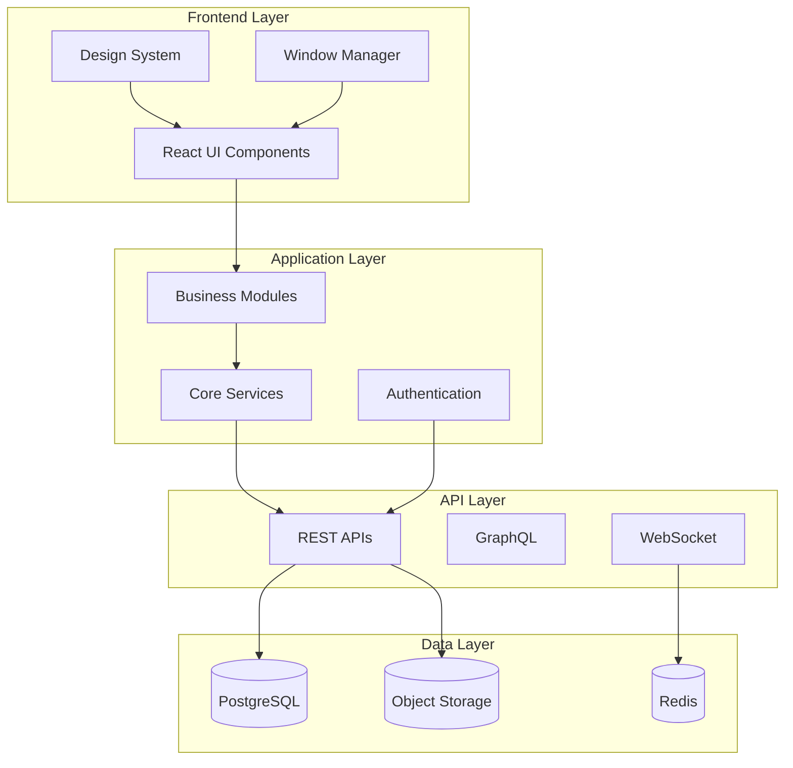

# Plataforma.dev Documentation

Welcome to the comprehensive documentation for **Plataforma.dev** - an AI-first enterprise platform that functions as a virtual operating system in the browser.

## 📋 Table of Contents

### Getting Started
- [Quick Start Guide](./GETTING_STARTED.md) - Get up and running in minutes
- [Installation & Setup](./INSTALLATION.md) - Detailed installation instructions
- [Architecture Overview](./ARCHITECTURE.md) - System design and architecture

### Development
- [Module Development](./MODULE_DEVELOPMENT.md) - Create and publish modules
- [API Reference](./API_REFERENCE.md) - Complete API documentation
- [Best Practices](./BEST_PRACTICES.md) - Code standards and conventions
- [Testing Guide](./TESTING.md) - Testing strategies and tools

### Deployment
- [Deployment Guide](./DEPLOYMENT.md) - Production deployment
- [Security Guide](./SECURITY.md) - Security best practices
- [Monitoring & Logging](./MONITORING.md) - Observability setup

### Developer Portal
- [Developer Portal](./developers/) - Tutorials, examples, and guides
- [API Documentation](./api/) - OpenAPI specs and endpoints
- [Plugin Development](./plugins/) - Create and distribute plugins

### Migration & Updates
- [Migration Guide](./MIGRATION.md) - Migrate from monolithic to distributed OS
- [Changelog](./CHANGELOG.md) - Version history and changes
- [Roadmap](./ROADMAP.md) - Future development plans

## 🚀 What is Plataforma.dev?

Plataforma.dev is a revolutionary enterprise platform that transforms how businesses operate by providing:

### Core Features
- **🖥️ Virtual Desktop Environment**: Windows-style interface with floating windows and taskbar
- **🧠 AI-First Architecture**: Built-in artificial intelligence across all modules
- **📊 Real-time Database System**: PostgreSQL with real-time updates via Supabase
- **🔧 Modular Architecture**: 20+ business modules with plugin system
- **🎨 Glassmorphism Design System**: Modern, accessible UI components
- **🔐 Enterprise Security**: Role-based access control and audit trails

### Business Modules
The platform includes comprehensive modules for:
- **Sales & CRM**: Customer relationship management
- **Finance & Accounting**: Financial management and reporting  
- **Inventory & Supply Chain**: Stock control and logistics
- **Human Resources**: Employee management and payroll
- **Marketing & Communications**: Campaign management and analytics
- **Legal & Compliance**: Contract and compliance management
- **And 14+ more specialized modules**

### Technical Stack
- **Frontend**: React 18 + TypeScript + Tailwind CSS
- **Backend**: Node.js + Express + PostgreSQL
- **Real-time**: Supabase Realtime + WebSockets
- **UI Library**: Radix UI + Shadcn/ui components
- **State Management**: TanStack Query + React Context
- **Build Tools**: Vite + SWC for fast builds
- **Testing**: Jest + Playwright for comprehensive testing
- **Container**: Docker + Kubernetes for scalable deployment

## 🏗️ Architecture Overview



## 📚 Quick Navigation

| I want to... | Go to |
|---------------|-------|
| **Start developing immediately** | [Getting Started Guide](./GETTING_STARTED.md) |
| **Understand the architecture** | [Architecture Documentation](./ARCHITECTURE.md) |
| **Create a new module** | [Module Development Guide](./MODULE_DEVELOPMENT.md) |
| **Use the APIs** | [API Reference](./API_REFERENCE.md) |
| **Deploy to production** | [Deployment Guide](./DEPLOYMENT.md) |
| **Contribute to the project** | [Contributing Guidelines](./CONTRIBUTING.md) |

## 🎯 Key Concepts

### Module System
Modules are self-contained business units that provide specific functionality:
- **Business Modules**: Sales, Finance, HR, etc.
- **System Modules**: Authentication, Database, Settings
- **Plugin Modules**: Third-party extensions

### Window Management
The desktop-like interface allows users to:
- Open multiple modules simultaneously
- Drag and resize windows
- Minimize/maximize windows
- Persist window states

### Real-time Collaboration
All data changes are synchronized in real-time across:
- Multiple users
- Different browser tabs
- Mobile and desktop clients

## 🚦 Getting Started

1. **Quick Start** (5 minutes)
   ```bash
   git clone https://github.com/betofilippi/plataforma.dev
   cd plataforma.dev
   npm install
   npm run dev
   ```

2. **Development Setup** (15 minutes)
   - Follow our [detailed setup guide](./GETTING_STARTED.md)
   - Configure your environment variables
   - Set up database connections

3. **Create Your First Module** (30 minutes)
   - Use our [module development tutorial](./developers/module-tutorial.md)
   - Learn the module architecture
   - Deploy your first custom module

## 📖 Documentation Standards

This documentation follows these principles:
- **Comprehensive**: Covers all aspects from basics to advanced
- **Practical**: Real-world examples and code snippets
- **Up-to-date**: Synchronized with the latest codebase
- **Accessible**: Clear language and good structure
- **Interactive**: Working examples and tutorials

## 🤝 Contributing to Documentation

We welcome documentation improvements! See our [Contributing Guidelines](./CONTRIBUTING.md) for details on:
- Writing style and standards
- Documentation structure
- Review process
- Translation guidelines

## 📞 Support & Community

- **GitHub Issues**: [Report bugs and request features](https://github.com/betofilippi/plataforma.dev/issues)
- **Discussions**: [Community discussions](https://github.com/betofilippi/plataforma.dev/discussions)
- **Email**: support@plataforma.dev
- **Discord**: [Join our developer community](https://discord.gg/plataforma-dev)

---

**Last Updated**: August 2025  
**Version**: 2.0.0  
**License**: MIT