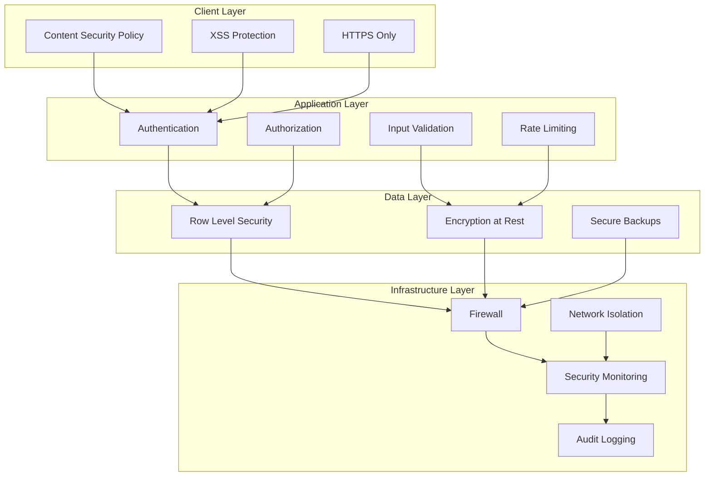

# Security Guide

Comprehensive security guide for Plataforma.dev, covering authentication, authorization, data protection, and security best practices.

## 📋 Table of Contents

- [Security Overview](#security-overview)
- [Authentication System](#authentication-system)
- [Authorization & Permissions](#authorization--permissions)
- [Data Security](#data-security)
- [API Security](#api-security)
- [Infrastructure Security](#infrastructure-security)
- [Client-Side Security](#client-side-security)
- [Security Monitoring](#security-monitoring)
- [Incident Response](#incident-response)
- [Compliance & Standards](#compliance--standards)
- [Security Checklist](#security-checklist)

## 🛡️ Security Overview

Plataforma.dev implements a multi-layered security approach:

### Security Architecture



### Security Principles

1. **Defense in Depth**: Multiple layers of security controls
2. **Zero Trust**: Never trust, always verify
3. **Least Privilege**: Minimum required access rights
4. **Secure by Default**: Secure configurations out of the box
5. **Continuous Monitoring**: Real-time threat detection
6. **Privacy by Design**: Data protection built-in

## 🔐 Authentication System

### JWT Token Security

**Token Configuration**:
```javascript
const JWT_CONFIG = {
  algorithm: 'HS256',
  secret: process.env.JWT_SECRET, // Min 32 characters
  expiresIn: '1h',
  issuer: 'plataforma.dev',
  audience: 'plataforma-users',
  
  // Security headers
  httpOnly: true,
  secure: true, // HTTPS only
  sameSite: 'strict',
  
  // Refresh token
  refreshToken: {
    expiresIn: '7d',
    algorithm: 'HS256'
  }
};
```

**Secure Token Generation**:
```javascript
import jwt from 'jsonwebtoken';
import crypto from 'crypto';

class TokenManager {
  generateAccessToken(user) {
    const payload = {
      sub: user.id,
      email: user.email,
      roles: user.roles,
      iat: Math.floor(Date.now() / 1000),
      jti: crypto.randomUUID() // Unique token ID
    };
    
    return jwt.sign(payload, process.env.JWT_SECRET, {
      expiresIn: JWT_CONFIG.expiresIn,
      issuer: JWT_CONFIG.issuer,
      audience: JWT_CONFIG.audience
    });
  }
  
  generateRefreshToken(userId) {
    return jwt.sign(
      { sub: userId, type: 'refresh' },
      process.env.REFRESH_SECRET,
      { expiresIn: '7d' }
    );
  }
  
  verifyToken(token) {
    try {
      return jwt.verify(token, process.env.JWT_SECRET, {
        issuer: JWT_CONFIG.issuer,
        audience: JWT_CONFIG.audience
      });
    } catch (error) {
      throw new Error('Invalid token');
    }
  }
}
```

### Password Security

**Password Requirements**:
- Minimum 12 characters
- Mixed case letters, numbers, symbols
- No common passwords or dictionary words
- No reuse of last 12 passwords

**Password Hashing**:
```javascript
import bcrypt from 'bcryptjs';
import argon2 from 'argon2';

class PasswordManager {
  async hashPassword(password) {
    // Use Argon2 for new passwords (recommended)
    return await argon2.hash(password, {
      type: argon2.argon2id,
      memoryCost: 2 ** 16, // 64 MB
      timeCost: 3,
      parallelism: 1,
    });
  }
  
  async verifyPassword(password, hash) {
    try {
      // Try Argon2 first
      if (hash.startsWith('$argon2')) {
        return await argon2.verify(hash, password);
      }
      
      // Fallback to bcrypt for legacy passwords
      return await bcrypt.compare(password, hash);
    } catch (error) {
      return false;
    }
  }
  
  async migratePassword(userId, password, oldHash) {
    // Migrate from bcrypt to Argon2
    if (!oldHash.startsWith('$argon2')) {
      const newHash = await this.hashPassword(password);
      await updateUserPassword(userId, newHash);
      return newHash;
    }
    return oldHash;
  }
}
```

### Multi-Factor Authentication

**TOTP Implementation**:
```javascript
import speakeasy from 'speakeasy';
import qrcode from 'qrcode';

class MFAManager {
  generateSecret(userEmail) {
    return speakeasy.generateSecret({
      name: `Plataforma (${userEmail})`,
      issuer: 'Plataforma.dev',
      length: 32
    });
  }
  
  async generateQRCode(secret) {
    return await qrcode.toDataURL(secret.otpauth_url);
  }
  
  verifyTOTP(token, secret) {
    return speakeasy.totp.verify({
      secret: secret,
      token: token,
      window: 2, // Allow 2 time steps
      time: 30   // 30 second window
    });
  }
  
  generateBackupCodes() {
    const codes = [];
    for (let i = 0; i < 10; i++) {
      codes.push(crypto.randomBytes(4).toString('hex').toUpperCase());
    }
    return codes;
  }
}
```

### Session Management

**Secure Session Configuration**:
```javascript
import session from 'express-session';
import RedisStore from 'connect-redis';

const sessionConfig = {
  store: new RedisStore({ client: redisClient }),
  secret: process.env.SESSION_SECRET,
  resave: false,
  saveUninitialized: false,
  
  cookie: {
    secure: process.env.NODE_ENV === 'production', // HTTPS only in prod
    httpOnly: true,    // Prevent XSS
    maxAge: 24 * 60 * 60 * 1000, // 24 hours
    sameSite: 'strict' // CSRF protection
  },
  
  // Session regeneration
  genid: () => crypto.randomUUID(),
  
  // Rolling sessions
  rolling: true,
  
  // Session fingerprinting
  name: 'plat.sid'
};

// Session validation middleware
const validateSession = (req, res, next) => {
  if (req.session) {
    // Check user agent consistency
    const currentUA = req.headers['user-agent'];
    if (req.session.userAgent && req.session.userAgent !== currentUA) {
      req.session.destroy();
      return res.status(401).json({ error: 'Session invalid' });
    }
    
    // Set user agent on first use
    if (!req.session.userAgent) {
      req.session.userAgent = currentUA;
    }
  }
  next();
};
```

## 🔑 Authorization & Permissions

### Role-Based Access Control (RBAC)

**Role Hierarchy**:
```typescript
interface Role {
  name: string;
  level: number;
  permissions: Permission[];
  inherits?: string[];
}

interface Permission {
  resource: string;
  action: string;
  conditions?: object;
  scope: 'own' | 'team' | 'organization' | 'system';
}

const ROLES: Role[] = [
  {
    name: 'super_admin',
    level: 100,
    permissions: [{ resource: '*', action: '*', scope: 'system' }]
  },
  {
    name: 'admin',
    level: 80,
    permissions: [
      { resource: 'users', action: '*', scope: 'organization' },
      { resource: 'modules', action: '*', scope: 'organization' },
      { resource: 'settings', action: '*', scope: 'organization' }
    ]
  },
  {
    name: 'manager',
    level: 60,
    permissions: [
      { resource: 'users', action: 'read', scope: 'team' },
      { resource: 'reports', action: '*', scope: 'team' },
      { resource: 'data', action: '*', scope: 'team' }
    ]
  },
  {
    name: 'user',
    level: 20,
    permissions: [
      { resource: 'profile', action: '*', scope: 'own' },
      { resource: 'data', action: 'read', scope: 'own' },
      { resource: 'modules', action: 'use', scope: 'own' }
    ]
  }
];
```

**Permission Checking**:
```javascript
class PermissionManager {
  async checkPermission(userId, resource, action, resourceId = null) {
    const user = await this.getUser(userId);
    const permissions = await this.getUserPermissions(userId);
    
    for (const permission of permissions) {
      if (this.matchesResource(permission.resource, resource) &&
          this.matchesAction(permission.action, action)) {
        
        // Check scope constraints
        if (await this.checkScope(permission, user, resourceId)) {
          return true;
        }
      }
    }
    
    return false;
  }
  
  async checkScope(permission, user, resourceId) {
    switch (permission.scope) {
      case 'own':
        return resourceId === user.id;
      case 'team':
        return await this.isInSameTeam(user.id, resourceId);
      case 'organization':
        return await this.isInSameOrganization(user.id, resourceId);
      case 'system':
        return true;
      default:
        return false;
    }
  }
  
  matchesResource(allowed, requested) {
    return allowed === '*' || allowed === requested;
  }
  
  matchesAction(allowed, requested) {
    return allowed === '*' || allowed === requested;
  }
}
```

### Attribute-Based Access Control (ABAC)

**Context-Aware Permissions**:
```javascript
class ABACManager {
  async evaluatePolicy(subject, resource, action, context) {
    const policies = await this.getPolicies(resource, action);
    
    for (const policy of policies) {
      if (await this.evaluateConditions(policy.conditions, {
        subject,
        resource,
        action,
        context
      })) {
        return policy.effect; // 'allow' or 'deny'
      }
    }
    
    return 'deny'; // Default deny
  }
  
  async evaluateConditions(conditions, data) {
    // Evaluate complex conditions
    // e.g., time-based access, location restrictions, etc.
    const evaluator = new PolicyEvaluator();
    return evaluator.evaluate(conditions, data);
  }
}

// Example policy
const timeBasedPolicy = {
  name: 'business_hours_only',
  conditions: {
    and: [
      { 'time.hour': { gte: 9, lte: 17 } },
      { 'time.day': { in: [1, 2, 3, 4, 5] } }, // Monday to Friday
      { 'user.department': 'finance' }
    ]
  },
  effect: 'allow'
};
```

## 🔒 Data Security

### Database Security

**Row Level Security (RLS)**:
```sql
-- Enable RLS on all tables
ALTER TABLE users ENABLE ROW LEVEL SECURITY;
ALTER TABLE documents ENABLE ROW LEVEL SECURITY;
ALTER TABLE audit_logs ENABLE ROW LEVEL SECURITY;

-- User can only access their own data
CREATE POLICY user_data_policy ON users
  FOR ALL TO authenticated
  USING (auth.uid()::text = id::text);

-- Team-based access policy
CREATE POLICY team_data_policy ON documents
  FOR ALL TO authenticated
  USING (
    team_id IN (
      SELECT team_id FROM team_members 
      WHERE user_id = auth.uid()::text
    )
  );

-- Admin can access everything
CREATE POLICY admin_all_access ON users
  FOR ALL TO authenticated
  USING (
    EXISTS (
      SELECT 1 FROM user_roles ur
      JOIN roles r ON ur.role_id = r.id
      WHERE ur.user_id = auth.uid()::text
      AND r.name = 'admin'
    )
  );

-- Audit policy - read-only for admins
CREATE POLICY audit_read_policy ON audit_logs
  FOR SELECT TO authenticated
  USING (
    EXISTS (
      SELECT 1 FROM user_roles ur
      JOIN roles r ON ur.role_id = r.id
      WHERE ur.user_id = auth.uid()::text
      AND r.name IN ('admin', 'auditor')
    )
  );
```

**Data Encryption**:
```javascript
import crypto from 'crypto';

class DataEncryption {
  constructor() {
    this.algorithm = 'aes-256-gcm';
    this.keyLength = 32;
    this.ivLength = 16;
    this.tagLength = 16;
  }
  
  encrypt(plaintext, key = process.env.ENCRYPTION_KEY) {
    const iv = crypto.randomBytes(this.ivLength);
    const cipher = crypto.createCipher(this.algorithm, key);
    cipher.setAAD(Buffer.from('plataforma', 'utf8'));
    
    let encrypted = cipher.update(plaintext, 'utf8', 'hex');
    encrypted += cipher.final('hex');
    
    const tag = cipher.getAuthTag();
    
    return {
      encrypted,
      iv: iv.toString('hex'),
      tag: tag.toString('hex')
    };
  }
  
  decrypt(encryptedData, key = process.env.ENCRYPTION_KEY) {
    const decipher = crypto.createDecipher(this.algorithm, key);
    decipher.setAAD(Buffer.from('plataforma', 'utf8'));
    decipher.setAuthTag(Buffer.from(encryptedData.tag, 'hex'));
    
    let decrypted = decipher.update(encryptedData.encrypted, 'hex', 'utf8');
    decrypted += decipher.final('utf8');
    
    return decrypted;
  }
  
  // Field-level encryption for sensitive data
  encryptPII(data) {
    const sensitiveFields = ['ssn', 'credit_card', 'phone', 'address'];
    const encrypted = { ...data };
    
    for (const field of sensitiveFields) {
      if (data[field]) {
        encrypted[field] = this.encrypt(data[field]);
      }
    }
    
    return encrypted;
  }
}
```

### Backup Security

**Encrypted Backups**:
```bash
#!/bin/bash
# secure-backup.sh

BACKUP_KEY=${BACKUP_ENCRYPTION_KEY}
DATE=$(date +%Y%m%d_%H%M%S)
BACKUP_FILE="backup_${DATE}.sql"
ENCRYPTED_FILE="${BACKUP_FILE}.gpg"

# Create database dump
pg_dump $DATABASE_URL > $BACKUP_FILE

# Encrypt backup
gpg --symmetric --cipher-algo AES256 --compress-algo 1 --s2k-mode 3 \
    --s2k-digest-algo SHA512 --s2k-count 65536 --force-mdc \
    --output $ENCRYPTED_FILE $BACKUP_FILE

# Secure delete original
shred -vfz -n 3 $BACKUP_FILE

# Upload encrypted backup
aws s3 cp $ENCRYPTED_FILE s3://secure-backups/database/ \
    --sse aws:kms --sse-kms-key-id your-kms-key-id

# Clean up
rm $ENCRYPTED_FILE

echo "Secure backup completed: $ENCRYPTED_FILE"
```

## 🌐 API Security

### Input Validation & Sanitization

**Request Validation**:
```javascript
import joi from 'joi';
import DOMPurify from 'dompurify';
import { JSDOM } from 'jsdom';

const window = new JSDOM('').window;
const purify = DOMPurify(window);

class InputValidator {
  static schemas = {
    user: joi.object({
      email: joi.string().email().max(255).required(),
      name: joi.string().min(2).max(100).pattern(/^[a-zA-Z\s]+$/).required(),
      password: joi.string().min(12).max(128).pattern(
        /^(?=.*[a-z])(?=.*[A-Z])(?=.*\d)(?=.*[@$!%*?&])[A-Za-z\d@$!%*?&]/
      ).required(),
      phone: joi.string().pattern(/^\+?[1-9]\d{1,14}$/)
    }),
    
    module: joi.object({
      name: joi.string().min(3).max(50).pattern(/^[a-zA-Z0-9-_]+$/).required(),
      version: joi.string().pattern(/^\d+\.\d+\.\d+$/).required(),
      description: joi.string().max(500).required()
    })
  };
  
  static validate(data, schema) {
    const { error, value } = this.schemas[schema].validate(data, {
      abortEarly: false,
      stripUnknown: true
    });
    
    if (error) {
      throw new ValidationError(error.details);
    }
    
    return value;
  }
  
  static sanitizeHTML(html) {
    return purify.sanitize(html, {
      ALLOWED_TAGS: ['b', 'i', 'em', 'strong', 'p', 'br'],
      ALLOWED_ATTR: []
    });
  }
  
  static sanitizeSQL(input) {
    // Basic SQL injection prevention
    const dangerous = /(\b(ALTER|CREATE|DELETE|DROP|EXEC(UTE){0,1}|INSERT( +INTO){0,1}|MERGE|SELECT|UPDATE|UNION( +ALL){0,1})\b)/gi;
    if (dangerous.test(input)) {
      throw new Error('Potentially dangerous SQL detected');
    }
    return input;
  }
}

// Validation middleware
const validateRequest = (schema) => (req, res, next) => {
  try {
    req.body = InputValidator.validate(req.body, schema);
    next();
  } catch (error) {
    res.status(400).json({ error: error.message });
  }
};
```

### Rate Limiting

**Advanced Rate Limiting**:
```javascript
import rateLimit from 'express-rate-limit';
import RedisStore from 'rate-limit-redis';

// Different limits for different endpoints
const authLimiter = rateLimit({
  store: new RedisStore({
    client: redisClient,
    prefix: 'rl:auth:'
  }),
  windowMs: 15 * 60 * 1000, // 15 minutes
  max: 5, // 5 attempts per window
  standardHeaders: true,
  legacyHeaders: false,
  message: {
    error: 'Too many authentication attempts, try again later'
  },
  skip: (req) => req.ip === process.env.ADMIN_IP
});

const apiLimiter = rateLimit({
  store: new RedisStore({
    client: redisClient,
    prefix: 'rl:api:'
  }),
  windowMs: 60 * 1000, // 1 minute
  max: 100, // 100 requests per minute
  standardHeaders: true,
  
  // Dynamic rate limiting based on user role
  keyGenerator: (req) => {
    if (req.user?.role === 'premium') return `premium:${req.ip}`;
    if (req.user?.role === 'admin') return `admin:${req.ip}`;
    return req.ip;
  },
  
  // Custom rate limits
  max: (req) => {
    if (req.user?.role === 'premium') return 1000;
    if (req.user?.role === 'admin') return 10000;
    return 100;
  }
});

// Progressive rate limiting
const progressiveLimiter = (req, res, next) => {
  const key = `progressive:${req.ip}`;
  
  redisClient.incr(key).then(count => {
    if (count === 1) {
      redisClient.expire(key, 3600); // 1 hour window
    }
    
    // Progressive penalties
    if (count > 1000) {
      return res.status(429).json({ error: 'Rate limit exceeded - 24h block' });
    } else if (count > 500) {
      // Add delay
      setTimeout(() => next(), 2000);
    } else if (count > 100) {
      setTimeout(() => next(), 1000);
    } else {
      next();
    }
  });
};
```

### CORS Configuration

**Secure CORS Setup**:
```javascript
import cors from 'cors';

const corsOptions = {
  origin: (origin, callback) => {
    // Allow requests from specific domains
    const allowedOrigins = [
      'https://app.plataforma.dev',
      'https://admin.plataforma.dev',
      process.env.CLIENT_URL
    ];
    
    // Allow development requests
    if (process.env.NODE_ENV === 'development') {
      allowedOrigins.push('http://localhost:3030');
    }
    
    if (!origin || allowedOrigins.includes(origin)) {
      callback(null, true);
    } else {
      callback(new Error('Not allowed by CORS'));
    }
  },
  
  credentials: true, // Allow cookies
  optionsSuccessStatus: 200,
  
  // Allowed headers
  allowedHeaders: [
    'Origin',
    'X-Requested-With',
    'Content-Type',
    'Accept',
    'Authorization',
    'X-API-Key'
  ],
  
  // Exposed headers
  exposedHeaders: [
    'X-RateLimit-Limit',
    'X-RateLimit-Remaining',
    'X-RateLimit-Reset'
  ]
};

app.use(cors(corsOptions));
```

## 🏗️ Infrastructure Security

### Network Security

**Firewall Configuration**:
```bash
#!/bin/bash
# firewall-setup.sh

# Reset iptables
iptables -F
iptables -X
iptables -t nat -F
iptables -t nat -X

# Default policies
iptables -P INPUT DROP
iptables -P FORWARD DROP
iptables -P OUTPUT ACCEPT

# Allow loopback
iptables -A INPUT -i lo -j ACCEPT

# Allow established connections
iptables -A INPUT -m conntrack --ctstate ESTABLISHED,RELATED -j ACCEPT

# Allow SSH (restrict to specific IPs)
iptables -A INPUT -p tcp --dport 22 -s YOUR_ADMIN_IP -j ACCEPT

# Allow HTTP/HTTPS
iptables -A INPUT -p tcp --dport 80 -j ACCEPT
iptables -A INPUT -p tcp --dport 443 -j ACCEPT

# Allow application ports (restrict to load balancer)
iptables -A INPUT -p tcp --dport 3030 -s LOAD_BALANCER_IP -j ACCEPT
iptables -A INPUT -p tcp --dport 4000 -s LOAD_BALANCER_IP -j ACCEPT

# Rate limiting
iptables -A INPUT -p tcp --dport 80 -m limit --limit 25/minute --limit-burst 100 -j ACCEPT
iptables -A INPUT -p tcp --dport 443 -m limit --limit 25/minute --limit-burst 100 -j ACCEPT

# Drop everything else
iptables -A INPUT -j DROP

# Save rules
iptables-save > /etc/iptables/rules.v4
```

### Container Security

**Secure Dockerfile**:
```dockerfile
# Use specific version, not latest
FROM node:18.17.0-alpine3.18

# Create non-root user
RUN addgroup -g 1001 -S plataforma && \
    adduser -S plataforma -u 1001

# Set working directory
WORKDIR /app

# Copy package files first (for layer caching)
COPY package*.json ./
COPY tsconfig.json ./

# Install dependencies
RUN npm ci --only=production && \
    npm cache clean --force

# Copy application code
COPY --chown=plataforma:plataforma . .

# Remove unnecessary files
RUN rm -rf tests/ docs/ .git/ *.md

# Build application
RUN npm run build

# Switch to non-root user
USER plataforma

# Expose port (non-privileged)
EXPOSE 3030

# Health check
HEALTHCHECK --interval=30s --timeout=3s --start-period=5s --retries=3 \
  CMD node healthcheck.js

# Start application
CMD ["node", "dist/index.js"]
```

**Docker Security Configuration**:
```yaml
# docker-compose.prod.yml
version: '3.8'

services:
  app:
    image: plataforma/app:latest
    
    # Security options
    security_opt:
      - no-new-privileges:true
    
    # Read-only root filesystem
    read_only: true
    
    # Temporary filesystem for writable areas
    tmpfs:
      - /tmp
      - /var/tmp
    
    # Resource limits
    deploy:
      resources:
        limits:
          cpus: '1.0'
          memory: 1G
        reservations:
          cpus: '0.5'
          memory: 512M
    
    # Capabilities
    cap_drop:
      - ALL
    cap_add:
      - NET_BIND_SERVICE
    
    # User override
    user: "1001:1001"
```

### Secrets Management

**Using HashiCorp Vault**:
```javascript
import vault from 'node-vault';

class SecretsManager {
  constructor() {
    this.client = vault({
      apiVersion: 'v1',
      endpoint: process.env.VAULT_ENDPOINT,
      token: process.env.VAULT_TOKEN
    });
  }
  
  async getSecret(path) {
    try {
      const result = await this.client.read(`secret/data/${path}`);
      return result.data.data;
    } catch (error) {
      throw new Error(`Failed to retrieve secret: ${error.message}`);
    }
  }
  
  async setSecret(path, data) {
    try {
      await this.client.write(`secret/data/${path}`, { data });
    } catch (error) {
      throw new Error(`Failed to store secret: ${error.message}`);
    }
  }
  
  // Rotate secrets periodically
  async rotateSecret(path, generator) {
    const oldSecret = await this.getSecret(path);
    const newSecret = generator();
    
    await this.setSecret(`${path}-new`, newSecret);
    
    // Update applications
    await this.updateApplications(path, newSecret);
    
    // Archive old secret
    await this.setSecret(`${path}-old`, oldSecret);
    
    // Set new secret as current
    await this.setSecret(path, newSecret);
  }
}
```

## 🖥️ Client-Side Security

### Content Security Policy

**Strict CSP Configuration**:
```javascript
const cspDirectives = {
  defaultSrc: ["'self'"],
  scriptSrc: [
    "'self'",
    "'unsafe-inline'", // Only for development
    "https://cdn.jsdelivr.net",
    "https://unpkg.com"
  ],
  styleSrc: [
    "'self'",
    "'unsafe-inline'",
    "https://fonts.googleapis.com"
  ],
  fontSrc: [
    "'self'",
    "https://fonts.gstatic.com"
  ],
  imgSrc: [
    "'self'",
    "data:",
    "https:"
  ],
  connectSrc: [
    "'self'",
    "https://api.plataforma.dev",
    "wss://api.plataforma.dev"
  ],
  frameSrc: ["'none'"],
  objectSrc: ["'none'"],
  baseUri: ["'self'"],
  formAction: ["'self'"],
  upgradeInsecureRequests: []
};

// Generate CSP header
const cspHeader = Object.entries(cspDirectives)
  .map(([key, values]) => `${key.replace(/([A-Z])/g, '-$1').toLowerCase()} ${values.join(' ')}`)
  .join('; ');

app.use((req, res, next) => {
  res.setHeader('Content-Security-Policy', cspHeader);
  next();
});
```

### XSS Protection

**Client-Side XSS Prevention**:
```typescript
// XSS sanitization utility
class XSSSanitizer {
  private static readonly DANGEROUS_PATTERNS = [
    /<script\b[^<]*(?:(?!<\/script>)<[^<]*)*<\/script>/gi,
    /javascript:/gi,
    /on\w+\s*=/gi,
    /<iframe\b[^<]*(?:(?!<\/iframe>)<[^<]*)*<\/iframe>/gi
  ];
  
  static sanitizeHTML(html: string): string {
    let sanitized = html;
    
    for (const pattern of this.DANGEROUS_PATTERNS) {
      sanitized = sanitized.replace(pattern, '');
    }
    
    return sanitized;
  }
  
  static escapeHTML(text: string): string {
    const escapeMap: Record<string, string> = {
      '&': '&amp;',
      '<': '&lt;',
      '>': '&gt;',
      '"': '&quot;',
      "'": '&#x27;',
      '/': '&#x2F;'
    };
    
    return text.replace(/[&<>"'/]/g, (s) => escapeMap[s]);
  }
  
  static sanitizeUserInput(input: any): any {
    if (typeof input === 'string') {
      return this.escapeHTML(input);
    }
    
    if (Array.isArray(input)) {
      return input.map(item => this.sanitizeUserInput(item));
    }
    
    if (typeof input === 'object' && input !== null) {
      const sanitized: any = {};
      for (const [key, value] of Object.entries(input)) {
        sanitized[key] = this.sanitizeUserInput(value);
      }
      return sanitized;
    }
    
    return input;
  }
}

// React component wrapper for safe HTML rendering
const SafeHTML: React.FC<{ html: string }> = ({ html }) => {
  const sanitizedHTML = useMemo(() => 
    XSSSanitizer.sanitizeHTML(html), [html]
  );
  
  return (
    <div dangerouslySetInnerHTML={{ __html: sanitizedHTML }} />
  );
};
```

### Secure Storage

**Client-Side Data Protection**:
```typescript
class SecureStorage {
  private static readonly ENCRYPTION_KEY = 'plataforma-storage-key';
  
  // Encrypt data before storing
  static setItem(key: string, value: any): void {
    try {
      const encrypted = this.encrypt(JSON.stringify(value));
      localStorage.setItem(key, encrypted);
    } catch (error) {
      console.error('Failed to store encrypted data:', error);
    }
  }
  
  // Decrypt data when retrieving
  static getItem<T>(key: string): T | null {
    try {
      const encrypted = localStorage.getItem(key);
      if (!encrypted) return null;
      
      const decrypted = this.decrypt(encrypted);
      return JSON.parse(decrypted);
    } catch (error) {
      console.error('Failed to retrieve encrypted data:', error);
      return null;
    }
  }
  
  // Clear sensitive data
  static clearSensitiveData(): void {
    const sensitiveKeys = [
      'access_token',
      'refresh_token',
      'user_profile',
      'session_data'
    ];
    
    sensitiveKeys.forEach(key => localStorage.removeItem(key));
  }
  
  private static encrypt(data: string): string {
    // Simple XOR encryption (use Web Crypto API for production)
    return btoa(
      data.split('').map((char, index) => 
        String.fromCharCode(
          char.charCodeAt(0) ^ this.ENCRYPTION_KEY.charCodeAt(index % this.ENCRYPTION_KEY.length)
        )
      ).join('')
    );
  }
  
  private static decrypt(encryptedData: string): string {
    const data = atob(encryptedData);
    return data.split('').map((char, index) => 
      String.fromCharCode(
        char.charCodeAt(0) ^ this.ENCRYPTION_KEY.charCodeAt(index % this.ENCRYPTION_KEY.length)
      )
    ).join('');
  }
}
```

## 📊 Security Monitoring

### Audit Logging

**Comprehensive Audit System**:
```javascript
class AuditLogger {
  constructor(redisClient) {
    this.redis = redisClient;
    this.logQueue = 'audit:logs';
  }
  
  async logEvent(event) {
    const auditEntry = {
      id: crypto.randomUUID(),
      timestamp: new Date().toISOString(),
      user_id: event.userId,
      user_ip: event.ip,
      user_agent: event.userAgent,
      action: event.action,
      resource: event.resource,
      resource_id: event.resourceId,
      result: event.result, // 'success', 'failure', 'unauthorized'
      details: event.details,
      severity: event.severity, // 'low', 'medium', 'high', 'critical'
      metadata: {
        session_id: event.sessionId,
        request_id: event.requestId,
        module: event.module
      }
    };
    
    // Store in Redis for real-time monitoring
    await this.redis.lpush(this.logQueue, JSON.stringify(auditEntry));
    await this.redis.expire(this.logQueue, 86400); // Keep for 24 hours
    
    // Store in database for long-term retention
    await this.storeInDatabase(auditEntry);
    
    // Check for suspicious activity
    await this.checkSuspiciousActivity(auditEntry);
  }
  
  async checkSuspiciousActivity(entry) {
    const suspiciousPatterns = [
      // Multiple failed login attempts
      {
        pattern: { action: 'login', result: 'failure' },
        threshold: 5,
        timeWindow: 300, // 5 minutes
        severity: 'high'
      },
      
      // Privilege escalation attempts
      {
        pattern: { action: 'role_change' },
        threshold: 1,
        severity: 'critical'
      },
      
      // Mass data access
      {
        pattern: { action: 'data_export' },
        threshold: 3,
        timeWindow: 3600, // 1 hour
        severity: 'medium'
      }
    ];
    
    for (const pattern of suspiciousPatterns) {
      if (await this.matchesPattern(entry, pattern)) {
        await this.triggerAlert(entry, pattern);
      }
    }
  }
  
  async triggerAlert(entry, pattern) {
    const alert = {
      id: crypto.randomUUID(),
      timestamp: new Date().toISOString(),
      type: 'security_alert',
      severity: pattern.severity,
      description: `Suspicious activity detected: ${pattern.pattern.action}`,
      user_id: entry.user_id,
      user_ip: entry.user_ip,
      details: entry
    };
    
    // Send to security team
    await this.sendSecurityAlert(alert);
    
    // Auto-response for critical alerts
    if (pattern.severity === 'critical') {
      await this.autoResponse(entry);
    }
  }
  
  async autoResponse(entry) {
    // Temporary account lock for critical security events
    if (entry.action === 'multiple_failed_login') {
      await this.lockAccount(entry.user_id, 1800); // 30 minutes
    }
    
    // IP blocking for suspicious activity
    if (entry.severity === 'critical') {
      await this.blockIP(entry.user_ip, 3600); // 1 hour
    }
  }
}

// Middleware to log all requests
const auditMiddleware = (auditLogger) => (req, res, next) => {
  const startTime = Date.now();
  
  // Capture response
  const originalSend = res.send;
  res.send = function(data) {
    const responseTime = Date.now() - startTime;
    
    auditLogger.logEvent({
      userId: req.user?.id,
      ip: req.ip,
      userAgent: req.get('User-Agent'),
      action: `${req.method}:${req.path}`,
      resource: req.path,
      resourceId: req.params.id,
      result: res.statusCode < 400 ? 'success' : 'failure',
      details: {
        method: req.method,
        path: req.path,
        query: req.query,
        statusCode: res.statusCode,
        responseTime
      },
      severity: res.statusCode >= 500 ? 'high' : 'low',
      sessionId: req.sessionID,
      requestId: req.id
    });
    
    return originalSend.call(this, data);
  };
  
  next();
};
```

### Intrusion Detection

**Real-time Threat Detection**:
```javascript
class IntrusionDetection {
  constructor(redis) {
    this.redis = redis;
    this.rules = this.loadSecurityRules();
  }
  
  loadSecurityRules() {
    return [
      {
        name: 'sql_injection_attempt',
        pattern: /(\b(SELECT|INSERT|UPDATE|DELETE|DROP|CREATE|ALTER)\b.*\b(FROM|INTO|WHERE|SET)\b)/i,
        severity: 'high',
        action: 'block'
      },
      
      {
        name: 'xss_attempt',
        pattern: /<script\b[^<]*(?:(?!<\/script>)<[^<]*)*<\/script>/gi,
        severity: 'medium',
        action: 'sanitize'
      },
      
      {
        name: 'path_traversal',
        pattern: /\.\.[\/\\]/,
        severity: 'high',
        action: 'block'
      },
      
      {
        name: 'brute_force_login',
        pattern: 'failed_login',
        threshold: 10,
        timeWindow: 600, // 10 minutes
        severity: 'high',
        action: 'block_ip'
      }
    ];
  }
  
  async analyzeRequest(req) {
    const threats = [];
    
    // Check URL path
    for (const rule of this.rules) {
      if (rule.pattern instanceof RegExp) {
        if (rule.pattern.test(req.url) || rule.pattern.test(JSON.stringify(req.body))) {
          threats.push({
            rule: rule.name,
            severity: rule.severity,
            action: rule.action,
            details: 'Pattern match in request'
          });
        }
      }
    }
    
    // Check rate-based rules
    const rateLimitThreats = await this.checkRateLimits(req);
    threats.push(...rateLimitThreats);
    
    return threats;
  }
  
  async checkRateLimits(req) {
    const threats = [];
    const key = `rate_limit:${req.ip}`;
    const count = await this.redis.incr(key);
    
    if (count === 1) {
      await this.redis.expire(key, 60); // 1 minute window
    }
    
    if (count > 100) { // More than 100 requests per minute
      threats.push({
        rule: 'rate_limit_exceeded',
        severity: 'medium',
        action: 'throttle',
        details: `${count} requests in 1 minute`
      });
    }
    
    return threats;
  }
  
  async handleThreat(threat, req, res) {
    // Log the threat
    console.log('Security threat detected:', threat);
    
    switch (threat.action) {
      case 'block':
        res.status(403).json({ error: 'Request blocked by security policy' });
        break;
        
      case 'block_ip':
        await this.redis.setex(`blocked_ip:${req.ip}`, 3600, 'blocked');
        res.status(403).json({ error: 'IP temporarily blocked' });
        break;
        
      case 'throttle':
        await new Promise(resolve => setTimeout(resolve, 2000)); // 2 second delay
        break;
        
      case 'sanitize':
        // Sanitize request data
        req.body = this.sanitizeInput(req.body);
        break;
    }
  }
}
```

## 🚨 Incident Response

### Incident Response Plan

**Security Incident Workflow**:
```javascript
class IncidentResponse {
  constructor() {
    this.severityLevels = {
      LOW: { responseTime: 24 * 60 * 60 * 1000, escalation: false },
      MEDIUM: { responseTime: 4 * 60 * 60 * 1000, escalation: true },
      HIGH: { responseTime: 1 * 60 * 60 * 1000, escalation: true },
      CRITICAL: { responseTime: 15 * 60 * 1000, escalation: true }
    };
  }
  
  async handleIncident(incident) {
    const incidentId = crypto.randomUUID();
    
    // Log incident
    await this.logIncident(incidentId, incident);
    
    // Immediate containment for critical incidents
    if (incident.severity === 'CRITICAL') {
      await this.emergencyContainment(incident);
    }
    
    // Notify security team
    await this.notifySecurityTeam(incidentId, incident);
    
    // Start investigation
    await this.startInvestigation(incidentId, incident);
    
    // Set up monitoring
    await this.enhanceMonitoring(incident);
    
    return incidentId;
  }
  
  async emergencyContainment(incident) {
    switch (incident.type) {
      case 'data_breach':
        // Lock affected accounts
        await this.lockAffectedAccounts(incident.affectedUsers);
        
        // Revoke access tokens
        await this.revokeTokens(incident.affectedTokens);
        
        // Enable additional logging
        await this.enableDebugLogging();
        break;
        
      case 'malware_detected':
        // Isolate affected systems
        await this.isolateSystems(incident.affectedSystems);
        
        // Block malicious IPs
        await this.blockIPs(incident.maliciousIPs);
        break;
        
      case 'unauthorized_access':
        // Force password reset
        await this.forcePasswordReset(incident.affectedUsers);
        
        // Increase authentication requirements
        await this.enableEmergencyMFA();
        break;
    }
  }
  
  async generateIncidentReport(incidentId) {
    const incident = await this.getIncident(incidentId);
    const timeline = await this.getIncidentTimeline(incidentId);
    const impact = await this.assessImpact(incident);
    
    return {
      id: incidentId,
      summary: incident.summary,
      severity: incident.severity,
      timeline: timeline,
      impact: impact,
      rootCause: await this.analyzeRootCause(incident),
      remediation: await this.getRemediationSteps(incident),
      lessonsLearned: await this.getLessonsLearned(incident),
      recommendations: await this.getRecommendations(incident)
    };
  }
}
```

## 📋 Compliance & Standards

### GDPR Compliance

**Data Protection Implementation**:
```javascript
class GDPRCompliance {
  // Right to access personal data
  async getPersonalData(userId) {
    const tables = [
      'users', 'user_profiles', 'user_preferences',
      'audit_logs', 'sessions', 'user_data'
    ];
    
    const personalData = {};
    
    for (const table of tables) {
      personalData[table] = await this.db.query(
        `SELECT * FROM ${table} WHERE user_id = $1`,
        [userId]
      );
    }
    
    return personalData;
  }
  
  // Right to rectification
  async updatePersonalData(userId, updates) {
    await this.auditLogger.logEvent({
      userId,
      action: 'data_rectification',
      details: { updatedFields: Object.keys(updates) }
    });
    
    return await this.db.query(
      `UPDATE users SET ${Object.keys(updates).map((key, i) => `${key} = $${i + 2}`).join(', ')} 
       WHERE id = $1`,
      [userId, ...Object.values(updates)]
    );
  }
  
  // Right to erasure (right to be forgotten)
  async deletePersonalData(userId, reason) {
    // Anonymize instead of delete for audit purposes
    const anonymizedData = {
      email: `deleted_user_${userId}@anonymized.local`,
      name: 'Deleted User',
      phone: null,
      address: null,
      date_of_birth: null,
      profile_data: null
    };
    
    await this.updatePersonalData(userId, anonymizedData);
    
    await this.auditLogger.logEvent({
      userId,
      action: 'data_erasure',
      details: { reason, anonymized: true }
    });
  }
  
  // Data portability
  async exportPersonalData(userId, format = 'json') {
    const data = await this.getPersonalData(userId);
    
    switch (format) {
      case 'csv':
        return this.convertToCSV(data);
      case 'xml':
        return this.convertToXML(data);
      default:
        return JSON.stringify(data, null, 2);
    }
  }
  
  // Consent management
  async recordConsent(userId, purpose, consentGiven) {
    await this.db.query(
      `INSERT INTO user_consents (user_id, purpose, consent_given, recorded_at)
       VALUES ($1, $2, $3, NOW())
       ON CONFLICT (user_id, purpose)
       DO UPDATE SET consent_given = $3, recorded_at = NOW()`,
      [userId, purpose, consentGiven]
    );
  }
  
  async getConsentStatus(userId) {
    return await this.db.query(
      `SELECT purpose, consent_given, recorded_at
       FROM user_consents
       WHERE user_id = $1`,
      [userId]
    );
  }
}
```

### SOC 2 Compliance

**Security Controls Implementation**:
```javascript
class SOC2Controls {
  // CC6.1 - Logical and physical access controls
  async implementAccessControls() {
    // Multi-factor authentication
    await this.enableMFA();
    
    // Regular access reviews
    await this.scheduleAccessReviews();
    
    // Privileged access management
    await this.implementPAM();
  }
  
  // CC6.2 - System access monitoring
  async implementAccessMonitoring() {
    // Real-time monitoring
    await this.enableRealtimeMonitoring();
    
    // Anomaly detection
    await this.implementAnomalyDetection();
    
    // Access attempt logging
    await this.enableAccessLogging();
  }
  
  // CC6.3 - Network security
  async implementNetworkSecurity() {
    // Firewall configuration
    await this.configureFirewalls();
    
    // Network segmentation
    await this.implementNetworkSegmentation();
    
    // Intrusion detection
    await this.deployIntrusionDetection();
  }
  
  // CC6.7 - Data transmission controls
  async implementTransmissionSecurity() {
    // Encryption in transit
    await this.enforceHTTPS();
    
    // API security
    await this.implementAPISecuirty();
    
    // Certificate management
    await this.manageCertificates();
  }
  
  // CC6.8 - Data classification
  async implementDataClassification() {
    const classifications = {
      PUBLIC: { encryption: false, retention: '7 years' },
      INTERNAL: { encryption: true, retention: '5 years' },
      CONFIDENTIAL: { encryption: true, retention: '3 years' },
      RESTRICTED: { encryption: true, retention: '1 year' }
    };
    
    return classifications;
  }
}
```

## ✅ Security Checklist

### Development Security Checklist

- [ ] **Authentication**
  - [ ] Strong password requirements (min 12 chars, complexity)
  - [ ] Multi-factor authentication implemented
  - [ ] JWT tokens properly configured (secure, httpOnly, sameSite)
  - [ ] Token refresh mechanism implemented
  - [ ] Session management secure (Redis, proper expiration)

- [ ] **Authorization**
  - [ ] Role-based access control (RBAC) implemented
  - [ ] Least privilege principle enforced
  - [ ] Permission checks on all endpoints
  - [ ] Resource-level access control

- [ ] **Input Validation**
  - [ ] All inputs validated and sanitized
  - [ ] SQL injection prevention (parameterized queries)
  - [ ] XSS protection implemented
  - [ ] File upload restrictions
  - [ ] Request size limits

- [ ] **API Security**
  - [ ] Rate limiting configured
  - [ ] CORS properly configured
  - [ ] API authentication required
  - [ ] Request/response validation
  - [ ] API versioning implemented

- [ ] **Data Security**
  - [ ] Database encryption at rest
  - [ ] Row Level Security (RLS) enabled
  - [ ] Sensitive data encrypted
  - [ ] Secure backup procedures
  - [ ] Data retention policies

### Production Security Checklist

- [ ] **Infrastructure**
  - [ ] HTTPS enforced (TLS 1.2+)
  - [ ] Security headers configured
  - [ ] Firewall rules configured
  - [ ] Network segmentation implemented
  - [ ] Regular security updates

- [ ] **Monitoring**
  - [ ] Security event logging
  - [ ] Intrusion detection system
  - [ ] Real-time alerting
  - [ ] Performance monitoring
  - [ ] Audit trail compliance

- [ ] **Incident Response**
  - [ ] Incident response plan documented
  - [ ] Security team contacts defined
  - [ ] Automated containment procedures
  - [ ] Backup and recovery procedures
  - [ ] Communication protocols

- [ ] **Compliance**
  - [ ] GDPR compliance implemented
  - [ ] Data protection policies
  - [ ] Regular security assessments
  - [ ] Employee security training
  - [ ] Vendor security reviews

### Regular Security Tasks

- [ ] **Daily**
  - [ ] Monitor security alerts
  - [ ] Review failed login attempts
  - [ ] Check system health metrics

- [ ] **Weekly**
  - [ ] Review access logs
  - [ ] Update threat intelligence
  - [ ] Test backup procedures

- [ ] **Monthly**
  - [ ] Access rights review
  - [ ] Security patch updates
  - [ ] Penetration testing
  - [ ] Security metrics review

- [ ] **Quarterly**
  - [ ] Full security assessment
  - [ ] Incident response drill
  - [ ] Security policy review
  - [ ] Staff security training

---

This security guide provides comprehensive protection for Plataforma.dev. Regular security assessments and updates to security measures are essential for maintaining a strong security posture.